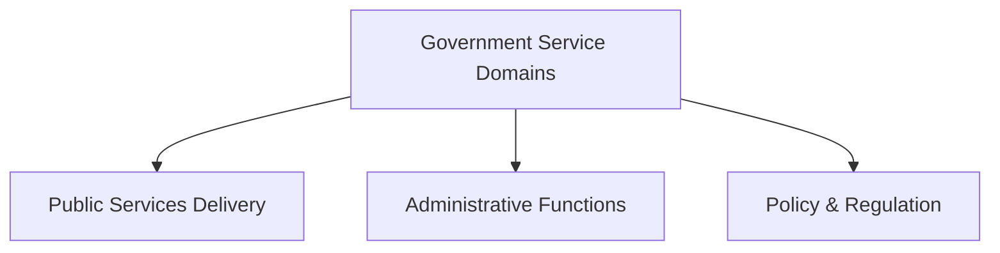

## § 0  How to Read This Handbook

> *A practitioner's guide to DataBooks — what they are, why they exist,
> and how to use the format and the CLI in a real pipeline.*

A DataBook is a Markdown file that works as three things at once: a
human-readable document you can open in any text editor, a typed data
container that a pipeline processor can extract and load, and a
self-describing semantic artefact that carries its own provenance,
identity, and graph metadata. You do not need a triplestore to read one.
You do not need a special viewer to write one. The format disciplines are
enforced by convention and by the CLI, not by infrastructure.

This handbook covers both the format and the tooling. The two tracks
run in parallel — you can read them together or jump between them:

**Track A — The Format** covers what a DataBook is and how to write one:
the three-zone structure, the frontmatter property set, the fenced block
type vocabulary, the block directive system, the process stamp, manifests,
transformer libraries, processor registries, and parameterised queries.

**Track B — The CLI** covers how the `databook` command-line tool
(v1.4.4) ingests, validates, queries, transforms, and LLM-augments
DataBooks in a production pipeline.

Sections covering primarily the format are marked **(Format)**; sections
covering primarily the CLI are marked **(CLI)**; sections covering both
are marked **(Both)**.

Throughout the handbook a single example runs from beginning to end: a
SKOS government service domain taxonomy — a vocabulary classifying the principal
service areas of a national government.
It starts as a handful of triples in §2, acquires a full frontmatter block
in §3, gains query blocks and directives in §§4–5, and travels through a
complete CLI pipeline in §12. Everything is connected; the file grows with
the reader.

**What this handbook does not cover.** The normative specification is the
README at `https://github.com/kurtcagle/databook` (v0.9) and the
accompanying SKILL.md (v1.2). This handbook explains the *why* and the
*how*; the spec is the *what*. The encryption profile (§13) is covered
briefly; full cryptographic implementation details are in the spec.

---

## § 1  The DataBook Idea

> *Structured data below the triple-store threshold — and why it still
> deserves to be structured.*

Most knowledge engineering work produces two kinds of artefacts: large
persistent graphs that live in a triplestore and are queried continuously,
and small task-specific artefacts that move between pipeline stages, accumulate
provenance, and eventually get archived or discarded. The first category is
well-served by Jena, Virtuoso, Stardog, and their peers. The second category
is typically served by plain files — a Turtle fragment here, a YAML config
there, a SPARQL query saved as a text file with no metadata, a SHACL shapes
graph with no record of who produced it or from what.

This is the gap DataBooks fill. Not the triple-store problem — the
*below-the-indexing-threshold* problem.

### The Microdatabase

The most useful frame for a DataBook is the *microdatabase* — a data
container appropriate for content that is too small and too task-specific
to warrant indexed triple-store infrastructure, but too structured and too
important to be treated as a plain file. A rough scale heuristic:

| Data scale | Appropriate store | Use a DataBook? |
|---|---|---|
| < 10K triples, task-specific | DataBook | Yes |
| < 10K triples, persistent reference | DataBook or named graph | Probably |
| 10K–1M triples, frequently queried | Triple store | No |
| Pipeline intermediate, any size | DataBook for stage output | Yes |
| Archival snapshot, infrequently queried | DataBook or graph archive | Yes |
| SHACL shapes graph, SPARQL library | DataBook | Yes |

The boundary is a design judgement about indexing overhead, not a hard rule.
The key insight is that *not worth indexing* does not mean *not worth
structuring*. DataBooks provide structure without infrastructure.

### What "Structure" Means Here

When a plain Turtle file moves between pipeline stages, you lose track of
who produced it, when, from what inputs, by which transformer. When the
pipeline fails, you cannot tell at a glance which stage broke, or whether
the output of stage 3 was derived from a validated stage 2 or a provisional
one. When you come back to the file six months later, the context is gone.

A DataBook solves this by attaching the context directly to the data:

- **Identity** — a stable IRI that uniquely identifies this artefact,
  independent of its filename or file system location
- **Provenance** — a process stamp recording what transformer produced
  the data, from which inputs, with what authority, at what timestamp
- **Typing** — fenced block labels that tell a parser exactly how to
  handle each payload without consulting an external registry
- **Addressability** — block identifiers that let pipeline stages
  reference specific blocks by fragment IRI rather than by file and
  line number

None of this requires a server. A DataBook is a file. It can be committed
to version control, attached to an email, copied to a network share, or
uploaded to a GDrive folder. It is readable in any Markdown viewer. It is
processable by any DataBook-aware tool. And when it arrives at the next
pipeline stage, all its metadata arrives with it.

### What a DataBook Is Not

A DataBook is not a replacement for a triple store. Large, frequently-queried
production graphs belong in Jena or Virtuoso, not in `.databook.md` files
on a filesystem. A DataBook is not a versioned file format — the `version`
field in the frontmatter records the document version, not a schema version.
It is not a publishing format — it is an engineering artefact. And it is not
a substitute for proper data modelling: a DataBook carries whatever data you
put in it; the quality of that data is your responsibility, not the format's.

The three-layer structure — frontmatter, fenced data blocks, prose — is
where we turn next.

---

## § 2  Your First DataBook

> *From a Turtle file to a conformant DataBook in three steps — and the
> government service domain taxonomy thread begins.*

National digital government initiatives produce dozens of small RDF artefacts
per project: taxonomy fragments, SHACL shapes graphs, SPARQL query libraries,
validation reports, and integration snapshots. For many teams these lived as
plain Turtle files in shared folders. The DataBook format addresses exactly
this: files that need to travel between pipeline stages, carry their own
provenance, and remain legible to analysts who were not part of the original
workshop session.

The running example in this handbook is a SKOS government service domain
taxonomy — a vocabulary classifying the principal service areas of a national
government. It begins here, minimal, and grows through every subsequent section.

### File Conventions

DataBooks use the `.databook.md` double extension. The `.md` suffix ensures
compatibility with every Markdown renderer — GitHub, Obsidian, VS Code, the
Claude interface. The `.databook` infix signals DataBook-aware tooling. Both
components serve a purpose; neither should be dropped.

Filenames should be kebab-case and should reflect the content identity, not
the creation date. Versioning belongs in the frontmatter `version` field:

```
gov-service-domains.databook.md       # good
gov-service-domains-v2.databook.md    # acceptable when version in name aids navigation
2026-06-09-gov-taxonomy.md               # avoid — date-as-name ages poorly, missing infix
```

### The Three-Zone Structure

A DataBook has three zones, strictly in this order:

1. **YAML frontmatter block** — mandatory; must come first; bounded by `---`
   on its own line at the start and end
2. **Prose and fenced blocks** — mandatory; at least one fenced data block
   must be present; prose and blocks interleave freely in this zone

That ordering is fixed. Content before the opening `---` prevents frontmatter
detection. Content missing after it is not a DataBook — it is plain Markdown.

### The `---` Delimiter Rule

DataBook frontmatter uses plain YAML delimited by `---` only. This is the
canonical form from v1.1 onward. It renders correctly in GitHub, in Claude,
and in every standard Markdown renderer. An older `<script language=
"application/yaml">` wrapper exists as an accepted alternative for backward
compatibility with v1.0 artefacts, but it is not canonical and should not
appear in new DataBooks.

> **Rule, no exceptions:** frontmatter MUST use plain `---` delimiters.
> Never wrap in `<script>` tags in any DataBook you produce.

### The Minimum Viable DataBook

Five identity fields are required: `id`, `title`, `type`, `version`,
`created`. The body needs at least one fenced data block with a
`<!-- databook:id: ... -->` identifier comment immediately preceding its
opening fence.

Here is the government service domain taxonomy as a minimum viable DataBook:

<!-- databook:id: primer-example-01 -->
<!-- mode=example norm=false -->
```markdown
---
id: https://govmeta.example.org/databooks/gov-service-domains-v1
title: "Government Service Domain Taxonomy"
type: databook
version: 1.0.0
created: 2026-06-09
---

## Overview

A SKOS concept scheme classifying the principal service domains
used in e-government country analysis engagements. Three top concepts:
Infrastructure, Services, and Governance.

## Taxonomy

<!-- databook:id: taxonomy-block -->
```turtle
@prefix rdf:    <http://www.w3.org/1999/02/22-rdf-syntax-ns#> .
@prefix skos:   <http://www.w3.org/2004/02/skos/core#> .
@prefix govmeta:   <https://govmeta.example.org/taxonomy/services/> .

govmeta:ServiceDomainScheme a skos:ConceptScheme ;
    skos:prefLabel "Government Service Domains"@en .

govmeta:PublicServices a skos:Concept ;
    skos:inScheme      govmeta:ServiceDomainScheme ;
    skos:prefLabel     "Public Services Delivery"@en ;
    skos:topConceptOf  govmeta:ServiceDomainScheme .

govmeta:AdministrativeFunctions a skos:Concept ;
    skos:inScheme      govmeta:ServiceDomainScheme ;
    skos:prefLabel     "Administrative Functions"@en ;
    skos:topConceptOf  govmeta:ServiceDomainScheme .

govmeta:PolicyRegulation a skos:Concept ;
    skos:inScheme      govmeta:ServiceDomainScheme ;
    skos:prefLabel     "Policy & Regulation"@en ;
    skos:topConceptOf  govmeta:ServiceDomainScheme .
```
```

Three things to notice:

**The `id` field** carries a stable IRI that uniquely identifies this
DataBook independent of its filename or location. This is not a URL
that needs to resolve today — it is the persistent identity of the
artefact. When it travels to the next pipeline stage, its IRI travels
with it.

**The `<!-- databook:id: taxonomy-block -->` comment** immediately precedes
the opening fence. This is the block identifier — it enables the CLI to
address the block directly as `{document-iri}#taxonomy-block`. The comment
must be immediately before the opening fence; a blank line between the
comment and the fence breaks addressability.

**The `process` stamp is absent.** This is intentional here — the minimum
viable DataBook is the smallest conformant artefact. Once any transformer
(LLM, SPARQL engine, or human) produces the data, the process stamp becomes
required. We add it in §6.

### What Not to Do

<!-- databook:id: primer-example-02 -->
<!-- mode=example norm=false -->
```markdown
<script language="application/yaml">
---
id: gov-taxonomy           # Not a stable IRI — relative and ambiguous
title: taxonomy             # Missing quotes; will break YAML parsers if
                            # the title contains colons
type: databook
version: 1
created: 2026-06-09
---
</script>

## Taxonomy

```turtle                   # Block has no databook:id — not addressable
@prefix govmeta: <https://govmeta.example.org/taxonomy/services/> .
govmeta:PublicServices a <http://www.w3.org/2004/02/skos/core#Concept> .
```
```

Four problems: the `<script>` wrapper is deprecated and must not appear in
new DataBooks; the `id` is not an IRI; the `title` is unquoted and will
cause a YAML parse error if it contains a colon; and the Turtle block has
no `databook:id`, making it unaddressable.

### Validating with the CLI

The DataBook CLI validates document structure before you push it into a
pipeline. Run it early and often:

<!-- databook:id: primer-example-03 -->
<!-- mode=example norm=false -->
```bash
$ databook validate gov-service-domains.databook.md

✓ Frontmatter: valid YAML, required fields present
✓ id:       https://govmeta.example.org/databooks/gov-service-domains-v1
✓ title:    "Government Service Domain Taxonomy"
✓ type:     databook
✓ version:  1.0.0
✓ created:  2026-06-09

Blocks: 1 found
  [1] turtle  #taxonomy-block  (line 19)

⚠ Warning: process stamp absent. Add 'process:' when data was produced
  by any transformer. A DataBook without a process stamp asserts unknown
  provenance.

Validation result: PASS (1 warning)
```

The warning about the missing process stamp is intentional — it is a
*Warning*, not a *Violation*. The document is structurally valid. The
CLI is correctly noting that provenance is undeclared. Once we add the
process stamp in §6, the warning disappears.

The `databook validate` command checks frontmatter completeness, required
fields, block identifier syntax, `graph.triple_count` consistency against
the actual block, directive syntax, and canonical namespace usage in
manifest and library blocks. It is the first command you run on any
DataBook you did not produce yourself.

---

## § 3  Frontmatter in Depth

> *The YAML block is not decoration — it is the DataBook's identity,
> provenance contract, and machine-readable self-description.*

The minimum viable DataBook in §2 carried five fields: `id`, `title`,
`type`, `version`, and `created`. That is enough for the CLI to validate
the document and find the blocks. It is not enough to make the DataBook
useful as a pipeline artefact — for that, you need the full frontmatter.
The fields fall into three groups.

### Identity Properties (Required)

These four fields are the DataBook's stable, unambiguous identity. A
DataBook without them is not a conformant DataBook.

**`id`** — A stable, globally unique IRI. This is the DataBook's
persistent identity, independent of its filename, location, or storage
system. It does not need to dereference today, but it should be
designed to dereference eventually — ideally to the DataBook itself, or
to a registry entry for it. Relative or opaque values (`gov-taxonomy`,
`my-databook`) are not conformant.

**`title`** — Human-readable title. Quote it if it contains colons,
brackets, or other YAML special characters; unquoted titles cause parse
failures that can be hard to trace. `"Government Service Domain Taxonomy"` is
safe; `Government Service Domain Taxonomy` (unquoted) risks a parse error.

**`type`** — The document class. Three recognised values:
- `databook` — standard DataBook carrying domain data, queries, or prompts
- `transformer-library` — catalogue of named, reusable transforms (§8)
- `processor-registry` — catalogue of named processors with capability
  declarations (§8)

**`version`** — Semantic version of this DataBook instance. Use
`1.0.0` for initial publication. Increment the patch version for
corrections, minor version for additions, major version for breaking
changes to the data model.

**`created`** — ISO date (`YYYY-MM-DD`). The date the DataBook was
first created — not the date it was last modified. Modification history
belongs in the `process` stamp (§6).

### Descriptive Properties (Recommended)

These fields make the DataBook discoverable, attributable, and
reusable beyond the session that produced it.

**`author`** — A sequence of author objects. Each carries `name`
(string), `iri` (stable IRI for the person or system), and `role`.
The role vocabulary has five values:

| Role | Meaning |
|---|---|
| `orchestrator` | The human directing the overall production |
| `transformer` | The process or agent that performed the primary transformation |
| `reviewer` | A human who validated the content after production |
| `editor` | A human who revised prose or structure without changing data |
| `contributor` | Any other contributing role |

Multiple authors are permitted and common — a DataBook produced by an
LLM under human direction carries both the model (`transformer`) and the
person (`orchestrator`).

**`license`** — SPDX identifier (`CC-BY-4.0`, `MIT`, `CC0-1.0`) or a
full IRI pointing to the licence document. If absent, the licensing
status is unknown — a problem for any DataBook intended for reuse.

**`domain`** — The primary ontology or vocabulary namespace this DataBook
operates within. Enables tooling to locate prefix declarations and
associated shapes without inspecting the data.

**`subject`** — A sequence of free-text keyword tags for discovery.
Complement to structured `domain`. Used by catalogue tools and search.

**`description`** — One-paragraph abstract for catalogue display. Distinct
from body prose — this text appears in listings and summaries, not in
the rendered document body.

### Graph Metadata (When the DataBook Contains RDF)

The `graph:` block characterises the RDF payload for parsers and
integrity checks.

**`namespace`** — The primary namespace IRI of entities defined in
the data blocks.

**`named_graph`** — The IRI of the named graph the primary data block
should be loaded into. By convention: `{document-id}#graph`. This is
what `databook push` uses as the target graph unless overridden by a
block-level `databook:graph` comment or a `--named-graph` flag.

**`triple_count`** and **`subjects`** — Integer counts of triples and
distinct subject IRIs in the primary block. The CLI checks these at
validation time and emits a warning on mismatch — they are an integrity
signal, not a hard constraint. Count them from the block; do not estimate.

**`rdf_version`** and **`turtle_version`** — `"1.1"` or `"1.2"`. If
any block uses RDF 1.2 reification syntax (`~ reifier {| ... |}`), both
fields MUST be `"1.2"`. Parsers that see `"1.2"` know to use a 1.2-
capable parser; parsers that see `"1.1"` can safely use rdflib or any
standard Turtle parser.

**`reification`** — `true` if any block uses RDF 1.2 annotated triple
syntax. When `true`, the CLI emits a `validator_note` warning if the
field is absent, and downstream pipelines know to use Jena 6.0 rather
than rdflib for this DataBook.

**`validator_note`** — Free-text note for parser-specific guidance. The
canonical rdflib workaround note belongs here: *"Requires Jena 6.0 for
full RDF 1.2 reification support. rdflib: load base graph; annotations
silently ignored."*

### Shapes Declaration (Situational)

```yaml
shapes:
  - https://example.org/shapes/SkosConceptSchemeShape
  - https://example.org/shapes/SkosConceptShape
```

Informational only — not enforced at the DataBook level. Its value is
downstream: a validator tool that receives the DataBook knows which SHACL
shapes to run against it without inspecting the data or asking the sender.

### The Full Frontmatter

Here is the government service domains DataBook with a complete recommended
frontmatter block, ready for production use:

<!-- databook:id: primer-example-04 -->
<!-- mode=example norm=false -->
```markdown
---
id: https://govmeta.example.org/databooks/gov-service-domains-v1
title: "Government Service Domain Taxonomy"
type: databook
version: 1.0.0
created: 2026-06-09

author:
  - name: Kurt Cagle
    iri: https://holongraph.com/people/kurt-cagle
    role: orchestrator
  - name: Chloe Shannon
    iri: https://holongraph.com/people/chloe-shannon
    role: transformer

license: CC-BY-4.0
domain: https://govmeta.example.org/taxonomy/services/
subject:
  - government service domains
  - government metadata
  - SKOS
  - e-government
description: >
  SKOS concept scheme classifying the principal service domains used
  in government metadata integration projects. Three top concepts:
  Public Services Delivery, Administrative Functions, and Policy &
  Regulation. Produced by LLM transformer from workshop ontology notes.

graph:
  namespace: https://govmeta.example.org/taxonomy/services/
  named_graph: https://govmeta.example.org/databooks/gov-service-domains-v1#graph
  triple_count: 10
  subjects: 4
  rdf_version: "1.1"
  turtle_version: "1.1"
  reification: false

shapes:
  - https://govmeta.example.org/shapes/SkosConceptSchemeShape
  - https://govmeta.example.org/shapes/SkosConceptShape
---
```

The `graph.triple_count` of 10 covers the `ConceptScheme` (2 triples)
and three `Concept` nodes (each with `a`, `skos:inScheme`, `skos:prefLabel`,
and `skos:topConceptOf` — 4 each minus the ConceptScheme subject = 8,
plus the scheme label = 10). Count from the block before setting the field.

### When RDF 1.2 Changes the Picture

Once a DataBook uses RDF 1.2 annotated triple syntax — anywhere in any
block — three frontmatter fields must change:

<!-- databook:id: primer-example-05 -->
<!-- mode=example norm=false -->
```yaml
graph:
  rdf_version: "1.2"
  turtle_version: "1.2"
  reification: true
  validator_note: >
    Requires Jena 6.0 or compatible RDF 1.2 parser for full reification
    support. For rdflib: extract the Turtle block content and parse with
    rdflib >= 7; reification annotations are silently ignored and the
    base graph loads correctly. Triple count includes base triples only;
    reifier annotation triples are not counted.
```

The `validator_note` is the place to document exactly this: what the
downstream parser needs to know. Do not put it in the body prose —
tooling cannot find it there.

---

## § 4  Fenced Data Blocks

> *Block labels are routing instructions for parsers — they tell the
> tool what to do with the payload, not what language it is written in.*

A DataBook body is a sequence of prose sections and fenced blocks in any
order. The fenced blocks carry the data; the prose explains it. A block's
label — the text after the opening triple backtick — tells a DataBook-
aware parser how to handle the content. It is not a MIME type, not a
syntax highlighter hint, and not decoration. It is a routing instruction.

### The Block Label Vocabulary

**Graph data labels** load into a triplestore session:

| Label | Interpretation | Use when |
|---|---|---|
| `turtle` | RDF Turtle 1.1 | Standard; use for all RDF unless reification is needed |
| `turtle12` | RDF Turtle 1.2 | Any block using `~ reifier {| ... |}` annotation syntax |
| `json-ld` | JSON-LD 1.1 | Interoperability with JSON-first systems |
| `trig` | TriG named graphs | Multiple named graphs in one block |
| `n-triples` | N-Triples | Machine-generated bulk data; no prefixes |
| `n-quads` | N-Quads | Machine-generated quads; includes graph IRI per triple |

**Query and constraint labels** are submitted to a query engine:

| Label | Interpretation |
|---|---|
| `sparql` | SPARQL 1.1/1.2 — SELECT, CONSTRUCT, ASK, DESCRIBE |
| `sparql-update` | SPARQL 1.1 Update — INSERT DATA, DELETE WHERE, etc. |
| `shacl` | SHACL shapes graph — typically Turtle serialisation |

**Prompt labels** are sent to a language model:

| Label | Interpretation |
|---|---|
| `prompt` | LLM prompt template; MAY use `{{variable}}` interpolation |
| `prompt-system` | System prompt template |
| `prompt-user` | User turn template |

**Build and catalogue labels** carry pipeline structure:

| Label | Interpretation |
|---|---|
| `manifest` | Build dependency graph using `build:` vocabulary (§7) |
| `transformer-library` | Catalogue of named transforms (§8) |
| `processor-registry` | Catalogue of named processors (§8) |

**Encrypted labels** carry ciphertext payloads (§13):

| Label | Interpretation |
|---|---|
| `encrypted` | Opaque base64 ciphertext; media type in frontmatter |
| `encrypted-turtle` | Encrypted Turtle content |
| `encrypted-jsonld` | Encrypted JSON-LD content |

Standard code fence labels — `python`, `bash`, `javascript`, `json`,
`yaml`, `xml` — are **display blocks only**. A DataBook parser must
not attempt to load a `python` block into a graph store. These labels
carry their normal Markdown meaning: syntax-highlighted code for a
human reader.

> **Note:** When a block uses the `turtle12` label, it signals to the
> entire toolchain that an RDF 1.2 parser is required. Set
> `graph.rdf_version: "1.2"` and `graph.reification: true` in
> frontmatter to match.

### Block-Level Comment Keys

Metadata for a specific block is attached via HTML comment lines
immediately *preceding* the opening fence — in the *pre-fence comment
zone*. These comments are invisible to standard Markdown renderers and
parseable by any DataBook-aware tool.

```
<!-- databook:id: taxonomy-block -->
<!-- databook:graph: https://govmeta.example.org/graphs/taxonomy -->
```turtle
...payload...
```
```

The `databook:` prefix is the reserved namespace for block metadata.
All recognised keys:

| Key | Description |
|---|---|
| `databook:id` | Block identifier — required for addressability; kebab-case; unique within document |
| `databook:graph` | Named graph IRI for this block; overrides `graph.named_graph` in frontmatter |
| `databook:label` | Human-readable label for this specific block |
| `databook:base` | Base IRI for relative IRI resolution within this block |
| `databook:import` | IRI of another DataBook to import prefix declarations from |
| `databook:encoding` | Character encoding if not UTF-8 |

Unrecognised `databook:` keys must be ignored without error. This
is the graceful degradation contract — future keys do not break
current parsers.

### The `databook:id` Rule

The block identifier comment must be *immediately* before the opening
fence. A blank line between the comment and the fence breaks the
association — the parser treats the comment as prose and the block
as unidentified.

```
<!-- databook:id: taxonomy-block -->     ← immediately before = correct
```turtle

<!-- databook:id: taxonomy-block -->     ← blank line before = broken

```turtle
```

Identifiers are kebab-case strings, unique within the document. They
enable fragment IRI addressing: `{document-id}#taxonomy-block`. This
is how the CLI retrieves a specific block, how pipeline stages reference
their inputs, and how the process stamp links to its sources.

### Multiple Blocks in One DataBook

A DataBook may contain as many fenced blocks as the content warrants.
When multiple primary data blocks are present, each must carry its own
`databook:id`. The prose between them explains their relationship.
Ordering is conventional: primary data block(s) first, then query
blocks, then validation shapes, then manifests.

Here is the government service domains DataBook with a second block —
a SPARQL query that retrieves all top-level concepts:

<!-- databook:id: primer-example-06 -->
<!-- mode=example norm=false -->
```markdown
## Taxonomy

<!-- databook:id: taxonomy-block -->
<!-- databook:graph: https://govmeta.example.org/databooks/gov-service-domains-v1#graph -->
```turtle
@prefix rdf:    <http://www.w3.org/1999/02/22-rdf-syntax-ns#> .
@prefix skos:   <http://www.w3.org/2004/02/skos/core#> .
@prefix govmeta:   <https://govmeta.example.org/taxonomy/services/> .

govmeta:ServiceDomainScheme a skos:ConceptScheme ;
    skos:prefLabel "Government Service Domains"@en .

govmeta:PublicServices a skos:Concept ;
    skos:inScheme      govmeta:ServiceDomainScheme ;
    skos:prefLabel     "Public Services Delivery"@en ;
    skos:topConceptOf  govmeta:ServiceDomainScheme .

govmeta:AdministrativeFunctions a skos:Concept ;
    skos:inScheme      govmeta:ServiceDomainScheme ;
    skos:prefLabel     "Administrative Functions"@en ;
    skos:topConceptOf  govmeta:ServiceDomainScheme .

govmeta:PolicyRegulation a skos:Concept ;
    skos:inScheme      govmeta:ServiceDomainScheme ;
    skos:prefLabel     "Policy & Regulation"@en ;
    skos:topConceptOf  govmeta:ServiceDomainScheme .
```

## Queries

Find all top concepts in the service domain scheme:

<!-- databook:id: select-top-concepts -->
```sparql
PREFIX skos: <http://www.w3.org/2004/02/skos/core#>
PREFIX govmeta: <https://govmeta.example.org/taxonomy/services/>

SELECT ?concept ?label WHERE {
    ?concept skos:inScheme    govmeta:ServiceDomainScheme ;
             skos:topConceptOf govmeta:ServiceDomainScheme ;
             skos:prefLabel    ?label .
    FILTER(LANG(?label) = "en")
}
ORDER BY ?label
```
```

Two blocks, two identifiers. The taxonomy block is addressed as
`{document-iri}#taxonomy-block`; the SPARQL block is addressed as
`{document-iri}#select-top-concepts`. Both can be retrieved independently
from the CLI.

### Fragment IRI Addressing from the CLI

Once blocks carry identifiers, the CLI can retrieve them individually:

<!-- databook:id: primer-example-07 -->
<!-- mode=example norm=false -->
```bash
# Push only the taxonomy block to the triplestore
$ databook push gov-service-domains.databook.md \
    --block taxonomy-block \
    --datastore <urn:jena:local>

Loaded: 10 triples → <https://govmeta.example.org/databooks/gov-service-domains-v1#graph>

# Execute the SPARQL query block directly against the store
$ databook pull gov-service-domains.databook.md#select-top-concepts \
    --datastore <urn:jena:local>

?concept                                        ?label
-------------------------------------------------------------
govmeta:PolicyRegulation    "Policy & Regulation"@en
govmeta:PublicServices "Public Services Delivery"@en
govmeta:AdministrativeFunctions      "Administrative Functions"@en
```

The fragment IRI `gov-service-domains.databook.md#select-top-concepts`
resolves to exactly the SPARQL block identified by `databook:id:
select-top-concepts`. The CLI loads the document, finds the block,
and submits its content to the declared datastore without any further
instruction.

This is the pattern that makes DataBooks work as self-contained, self-
describing pipeline components. The block label tells the CLI what kind
of payload it is. The `databook:id` tells the CLI which block to use.
The `databook:graph` tells the CLI where to load or query. Nothing else
is needed.

---

## § 5  Block Directives — The Mode System

> *Block directives are processing instructions for the DataBook pipeline.
> They live in the same pre-fence comment zone as `databook:` keys but
> speak a different language.*

The block identifier and graph comments introduced in §4 tell a parser
*what a block is*. Block directives tell a processor *what to do with it*.
The distinction matters when the same DataBook travels through different
stages of a pipeline — a SPARQL query block that should run against the
triplestore in production should display as readable code in a report
and be invisible in a client-facing summary. Block directives express
these intentions without modifying the block payload.

### Directives vs `databook:` Keys

Both are HTML comment lines in the pre-fence zone, but the syntax is
different and the purposes are distinct:

```
<!-- databook:id: taxonomy-block -->        ← databook: key (colon-separated)
<!-- mode=executed endpoint=<urn:jena:local> -->  ← directive (equals-separated)
```turtle
...payload...
```
```

A `databook:` key identifies and describes the block. A directive
instructs a processor. Parsers distinguish them by the comment content:
if it begins with `databook:`, it is a metadata key; if it uses
`key=value` pairs without the `databook:` prefix, it is a directive.

Multiple directive key-value pairs may appear on one line, or on
consecutive lines — the processor accumulates them:

```
<!-- mode=executed endpoint=<urn:jena:gov-store> cache=true -->
<!-- authority=<urn:org:e-government> version=1.2.0 -->
```

### The `mode` Directive

`mode` is the primary directive key. Five values:

**`mode=executed`** — the block is runnable. Submit its content to the
declared `endpoint` or execution environment. The result may be cached
back into the DataBook. Use this for SPARQL queries, SPARQL updates, and
SHACL validation runs in a live pipeline. Requires an `endpoint=<IRI>`
directive unless the endpoint is registered globally in a processor
registry.

**`mode=rendered`** — the block content is a rendering specification.
Hand it to the renderer indicated by the fence label: a `mermaid` block
goes to the diagram engine, a `geojson` block goes to a map layer
renderer, a `vega-lite` block goes to a chart engine. The result is
displayed inline.

**`mode=printed`** — display as syntax-highlighted code. The default
for standard code fence labels (`python`, `bash`, etc.). Documents that
the block is for reading, not execution.

**`mode=hidden`** — the block is present and fully accessible to
processors and LLMs reading the DataBook, but suppressed from all
rendered views. The canonical use is grounding records, provenance
trails, pipeline intermediate results, and system metadata — data that
the pipeline needs but a human reader does not. A hidden block is not
secret; it is simply not surfaced.

**`mode=reference`** — not displayed by default, but surfaceable on
demand by a client that explicitly requests it. A footnote model.
Distinct from `hidden`: a reference block may be exposed; a hidden
block is never surfaced.

### Additional Directive Keys

| Key | Applies to | Description |
|---|---|---|
| `endpoint=<IRI>` | `mode=executed` | SPARQL endpoint or service IRI to submit the block against |
| `cache=true\|false` | `mode=executed` | Store the execution result back into the DataBook (true) or re-execute every load (false). Default: false |
| `authority=<IRI>` | Any | Declares which named authority asserts the block's content — informs trust weighting in Bayesian contexts |
| `version=<semver>` | Any | Block-level version; allows a DataBook to carry both current and prior versions of a shape or query |
| `result-iri=<IRI>` | `mode=executed` | IRI of the output DataBook or named graph produced by this block's execution; set by the processor after execution |
| `expires=<dateTime>` | `mode=executed` | xsd:dateTime after which a cached result is stale and must be re-executed |

### Pre-Fence Zone Ordering

The pre-fence comment zone may contain both `databook:` keys and
directive keys. The convention for ordering within the zone keeps
things predictable for both parsers and readers:

1. `databook:id` — always first; the block's identity anchor
2. Other `databook:` keys — `databook:graph`, `databook:label`, etc.
3. Directive keys — `mode`, `endpoint`, `cache`, `authority`, etc.

### The Directives in Practice

Here is the government service domains DataBook's query block after adding
directives — the SPARQL block now has an execution target, and a
second hidden block carries the grounding record produced by the
pipeline's entity recognition pass:

<!-- databook:id: primer-example-08 -->
<!-- mode=example norm=false -->
```markdown
## Queries

<!-- databook:id: select-top-concepts -->
<!-- databook:graph: https://govmeta.example.org/databooks/gov-service-domains-v1#graph -->
<!-- mode=executed endpoint=<urn:jena:gov-store> cache=true -->
<!-- authority=<urn:org:e-government> -->
```sparql
PREFIX skos: <http://www.w3.org/2004/02/skos/core#>
PREFIX govmeta: <https://govmeta.example.org/taxonomy/services/>

SELECT ?concept ?label WHERE {
    ?concept skos:inScheme    govmeta:ServiceDomainScheme ;
             skos:topConceptOf govmeta:ServiceDomainScheme ;
             skos:prefLabel    ?label .
    FILTER(LANG(?label) = "en")
}
ORDER BY ?label
```

<!-- databook:id: grounding-record -->
<!-- databook:label: Pass 1 entity grounding output — session 2026-06-09 -->
<!-- mode=hidden authority=<urn:agent:pipeline> -->
```turtle
<urn:grounding:infra-001> a holon:GroundingRecord ;
    holon:sourceString "public services delivery" ;
    holon:matchedIRI   govmeta:PublicServices ;
    holon:matchType    holon:SemanticMatch ;
    holon:groundingConfidence "0.93"^^xsd:decimal .
```
```

The SPARQL block will be submitted to the e-government Jena store when the
pipeline processes this DataBook. Its result will be cached back. The
grounding record is visible to the pipeline and to any LLM reading the
full DataBook as context, but it is suppressed from human-facing
rendered views.

The second pattern — `mode=hidden` for intermediate pipeline data —
is one of the most useful in the DataBook toolkit. It keeps grounding
records, validation reports, and provenance details co-located with the
data they annotate, without cluttering the document for human readers.

A diagram block uses `mode=rendered`:

<!-- databook:id: primer-example-09 -->
<!-- mode=example norm=false -->
```markdown
## Taxonomy Diagram

<!-- databook:id: taxonomy-diagram -->
<!-- mode=rendered -->

```

The `mermaid` fence label plus `mode=rendered` tells the client to pass
the content to the Mermaid diagram engine and display the result inline.
The diagram is derived from the taxonomy data block and kept synchronised
with it manually here — in a pipeline deployment it would be generated
by a SPARQL CONSTRUCT transformer.

---

## § 6  The Process Stamp

> *A DataBook without a process stamp asserts that its provenance is
> unknown — which is worse than an imprecise stamp.*

When a DataBook moves between pipeline stages, the most important question
a downstream consumer can ask is: where did this data come from, and can
I trust it? The process stamp answers that question directly, in the
frontmatter, in a form that is human-readable, machine-parseable, and
graph-traversable via PROV-O.

The stamp is required whenever any transformer — an LLM, a SPARQL engine,
an XSLT stylesheet, or a human analyst — produced the data. A DataBook
whose provenance is genuinely unknown is a DataBook that should not be in
the pipeline.

### The Provenance Contract

The process stamp is a YAML projection of a PROV-O activity graph. The
mapping is exact and intentional:

| Process stamp field | PROV-O equivalent |
|---|---|
| The DataBook `id` | `prov:Entity` — the artefact that was produced |
| `process` block as a whole | `prov:Activity` — the production run |
| `process.transformer_iri` | `prov:wasAssociatedWith` — the software agent |
| `process.agent.iri` | `prov:wasAssociatedWith` — the human agent |
| `process.inputs[n].iri` | `prov:used` — the input artefacts consumed |
| `process.timestamp` | `prov:endedAtTime` |
| `created` | `prov:generatedAtTime` |

This mapping means a complete PROV-O graph can be mechanically derived
from the DataBook frontmatter. Tooling that materialises the process stamps
of a DataBook collection as RDF makes the full production lineage of every
artefact SPARQL-queryable — which DataBooks were produced by which
transformer, from which inputs, in what order.

### The Determinism Declaration

`transformer_type` does more than categorise the tool. It is a
*determinism declaration* — a statement about whether the same inputs will
always produce the same output.

| Type | Deterministic | Meaning |
|---|---|---|
| `llm` | No | Large language model — output varies between runs |
| `human` | No | Human author or annotator — output reflects judgement |
| `sparql` | Yes | SPARQL CONSTRUCT or DESCRIBE — same graph, same output |
| `xslt` | Yes | XSLT transformation — deterministic |
| `shacl` | Yes | SHACL validation or rule application |
| `service` | Varies | External API — depends on the service |
| `composite` | Varies | Orchestrated pipeline of multiple types |
| `script` | Varies | Custom code |
| `library-transform` | Varies | Named transform from a transformer library (§8) |
| `registry-processor` | Varies | Processor resolved from a processor registry (§8) |

A DataBook produced by `llm` or `human` is non-deterministic — running
the same pipeline again will likely produce different content. Document
this honestly. Downstream consumers reading the stamp can calibrate their
trust accordingly: a SPARQL-produced DataBook is reproducible; an LLM-
produced DataBook is not.

### Inputs and Roles

The `inputs` sequence is the most information-dense part of the stamp.
Each entry carries:

**`iri`** — The IRI of the input DataBook or resource. This is the
link that makes provenance chains traversable. If the IRI resolves to
another DataBook, that DataBook has its own process stamp, and the chain
can be followed as far back as the original sources.

**`role`** — What part the input played. Six values:

| Role | Meaning |
|---|---|
| `primary` | The principal data input being transformed or processed |
| `constraint` | A SHACL shapes graph or other normative constraint the output must satisfy |
| `context` | Background knowledge used to inform the transformation |
| `evidence` | Observational or empirical data from which assertions are derived |
| `reference` | A document consulted but not directly transformed |
| `template` | A structural scaffold whose form the output follows |

Multiple inputs of the same role are permitted. A DataBook produced from
three source graphs all serving as `primary` inputs is a valid stamp.

### Extended Properties

For DataBooks that are direct outputs of a pipeline stage and need to
declare where their content was sent, three additional process properties
are available:

```yaml
process:
  output_format: turtle            # fence-label of the output block type
  output_media_type: text/turtle   # MIME type for precision
  output:
    graph: https://govmeta.example.org/graphs/taxonomy
    url: http://localhost:3030/gov/data
    file: ./build/gov-service-domains.ttl
```

These are optional and situational — use them when the DataBook is the
canonical output record of a pipeline stage that routes data to external
systems.

### The Government Service Taxonomy — Production Stamp

Here is the government service domains DataBook with its full process stamp,
as it would look after being produced by an LLM transformer from a
session notes DataBook and a SHACL shapes constraint:

<!-- databook:id: primer-example-10 -->
<!-- mode=example norm=false -->
```yaml
process:
  transformer: "Claude Sonnet 4.6"
  transformer_type: llm
  transformer_iri: https://api.anthropic.com/v1/models/claude-sonnet-4-6
  inputs:
    - iri: https://govmeta.example.org/databooks/ontology-workshop-2026-06-09
      role: primary
      description: "Ontology workshop notes used as source material"
    - iri: https://govmeta.example.org/shapes/skos-concept-shape-v1
      role: constraint
      description: "SHACL shapes constraining the output taxonomy structure"
    - iri: https://govmeta.example.org/databooks/gov-standards-context-v3
      role: context
      description: "Government standards framework providing definitional context"
  timestamp: 2026-06-09T09:30:00Z
  agent:
    name: Kurt Cagle
    iri: https://holongraph.com/people/kurt-cagle
    role: orchestrator
  note: >
    Taxonomy produced from ontology workshop notes for a national
    e-government data integration project. Three top service domain
    concepts extracted; narrower concepts to be added in v2. Validated
    against SKOS concept scheme shapes — all constraints satisfied.
```

The stamp tells the next stage everything it needs: the taxonomy was
produced by Claude Sonnet 4.6 under Kurt Cagle's direction, from three
named inputs with declared roles, at a specific timestamp, with a plain-
language note explaining the scope and status. A downstream validation
step can verify the SHACL shapes constraint by resolving the `iri` and
checking the `role: constraint` input. A change to the session notes
DataBook triggers a rerun of this stage — the dependency is declared.

### Provenance Chain Traversal

Because every `inputs[n].iri` is itself a DataBook IRI, and every
DataBook carries its own process stamp, the full production lineage of
any artefact is graph-traversable. A SPARQL query over the materialised
provenance chain answers questions like: *which DataBooks were produced
from the session notes of June 9?* or *what is the complete set of inputs
that contributed to the final e-government country report?*

<!-- databook:id: primer-example-11 -->
<!-- mode=example norm=false -->
```sparql
# Find all DataBooks transitively derived from a changed source.
# Assumes process stamps have been materialised as PROV-O triples.

PREFIX prov: <http://www.w3.org/ns/prov#>
PREFIX gov: <https://govmeta.example.org/databooks/>

SELECT DISTINCT ?downstream ?title WHERE {
    ?downstream prov:wasDerivedFrom+ gov:ontology-workshop-2026-06-09 ;
                dcterms:title        ?title .
}
ORDER BY ?downstream
```

Run this query against a triplestore where the PROV-O materialisation
of each DataBook's process stamp has been loaded, and you get the
complete impact map for a change to the session notes. Every DataBook
in the result needs to be reviewed or regenerated. None of this requires
out-of-band tracking — it is all in the process stamps, all in the graph,
all queryable with standard SPARQL.

With the process stamp in place, the government service domains DataBook
is production-ready. It has a stable IRI, full descriptive metadata, a
characterised graph block, block identifiers, execution directives, and
a complete provenance trail. The next section — §7 — steps back from the
single DataBook and looks at how a collection of DataBooks describes a
pipeline.

---

## § 7  Manifests and Dependency Graphs

> *A manifest is the DataBook that makes other DataBooks a coherent system
> — it is the formal declaration of what depends on what.*

A single DataBook carries its own provenance. A pipeline of DataBooks needs
something to declare the relationships between them: which DataBook is the
final output, which are intermediate stages, which are raw sources with no
DataBook-format inputs. Without that declaration, a collection of DataBooks
is just a folder of files. With it, the entire pipeline structure is
SPARQL-queryable, change-impact analysis is automatic, and a downstream
consumer can trace any artefact back to its sources.

That declaration is the manifest DataBook.

### What a Manifest Is

A manifest is a DataBook whose primary data block carries a build dependency
graph using the `build:` vocabulary. The document type is still `databook`;
the manifest character comes from the block label — `manifest` — and the
vocabulary it uses.

The canonical namespace for the `build:` vocabulary is
`https://w3id.org/databook/ns#`. An older namespace
(`https://databook.org/ns/build#`) appears in some earlier DataBooks —
update it if you encounter it.

### The `build:` Vocabulary

Three classes model the three kinds of DataBook in a pipeline:

- **`build:Target`** — the desired output; the DataBook the pipeline exists
  to produce
- **`build:Stage`** — an intermediate DataBook produced by the pipeline and
  consumed by a downstream stage or target
- **`build:Source`** — a raw input with no DataBook-format dependencies;
  the pipeline's starting material

Two properties declare the structure:

- **`build:dependsOn`** — links a Target or Stage to the DataBook IRIs it
  needs as inputs. Transitive: if A depends on B and B depends on C, A
  transitively depends on C.
- **`build:transformer`** — the transformer type string used to produce this
  stage; matches the `transformer_type` vocabulary from the process stamp.

Two properties add type-checking to the dependency graph:

- **`build:outputType`** — the fence-label type of the DataBook this stage
  produces (`turtle`, `shacl`, `sparql`, etc.). Always set this — it
  enables pipeline validators to confirm that the output of one stage is
  the right format for the input of the next.
- **`build:inputType`** — the fence-label type expected as input.

### A Government Taxonomy Pipeline

The government service domain taxonomy does not exist in isolation. It
is produced from a raw workshop notes DataBook, passes through a SHACL
validation stage, and feeds a final annotated taxonomy. Here is the
manifest describing that pipeline:

<!-- databook:id: primer-example-12 -->
<!-- mode=example norm=false -->
```markdown
---
id: https://govmeta.example.org/databooks/gov-taxonomy-pipeline-manifest
title: "Government Service Domain Taxonomy — Build Manifest"
type: databook
version: 1.0.0
created: 2026-06-09
description: >
  Build dependency manifest for the government service domain taxonomy
  pipeline. Three stages: workshop notes source, LLM-generated SHACL
  shapes, LLM-generated taxonomy. Final target is the validated taxonomy.
---

## Pipeline

<!-- databook:id: pipeline-manifest -->
```manifest
@prefix build: <https://w3id.org/databook/ns#> .
@prefix gov:   <https://govmeta.example.org/databooks/> .

# ── Target — the validated, annotated taxonomy ──────────────────────────────

gov:gov-service-domains-v1 a build:Target ;
    build:outputType "turtle" ;
    build:dependsOn  gov:gov-service-shapes-v1 ,
                     gov:gov-service-domains-draft-v1 .

# ── Stage 1 — LLM-generated SHACL shapes from workshop notes ───────────────

gov:gov-service-shapes-v1 a build:Stage ;
    build:transformer "llm" ;
    build:inputType   "turtle" ;
    build:outputType  "shacl" ;
    build:dependsOn   gov:workshop-notes-v1 .

# ── Stage 2 — LLM-generated taxonomy draft from workshop notes ──────────────

gov:gov-service-domains-draft-v1 a build:Stage ;
    build:transformer "llm" ;
    build:inputType   "turtle" ;
    build:outputType  "turtle" ;
    build:dependsOn   gov:workshop-notes-v1 .

# ── Source — raw workshop notes; no DataBook dependencies ───────────────────

gov:workshop-notes-v1 a build:Source ;
    build:outputType "turtle" .
```
```

The dependency graph is explicit: both the shapes stage and the draft
taxonomy stage depend on the workshop notes source. The final target
depends on both intermediate stages — it represents the validated
combination. This is a diamond dependency: one source, two parallel
stages, one output.

### What the Manifest Enables

Because the manifest is RDF, it is SPARQL-queryable. Two queries earn
their place in every manifest DataBook.

**Change-impact analysis:** if the workshop notes source changes, which
stages and targets need to be regenerated?

<!-- databook:id: primer-example-13 -->
<!-- mode=example norm=false -->
```sparql
# Change impact: find all DataBooks transitively depending on a changed source.
# Run against the manifest graph.

PREFIX build: <https://w3id.org/databook/ns#>
PREFIX gov:   <https://govmeta.example.org/databooks/>

SELECT ?affected WHERE {
    ?affected build:dependsOn+ gov:workshop-notes-v1 .
}
```

The result includes all three downstream DataBooks. Any change to the
workshop notes triggers a full pipeline re-run. Without the manifest,
you would have to track this dependency manually in documentation that
quickly goes stale. With it, the impact analysis is a three-line SPARQL
query that runs against the graph itself.

**Topological build order:** in which order should stages be built?

```sparql
PREFIX build: <https://w3id.org/databook/ns#>

SELECT ?stage (COUNT(?dep) AS ?depth) WHERE {
    ?stage a build:Stage .
    OPTIONAL { ?stage build:dependsOn+ ?dep . ?dep a build:Source . }
}
GROUP BY ?stage
ORDER BY ?depth
```

Stages with fewer source dependencies are built first. The topological
sort is computable from the graph without any external build tool.

### The Manifest as First-Class Artefact

A manifest DataBook is itself a holon: self-describing, versioned, and
provenance-tracked. When the pipeline changes — a new stage is added, a
transformer is upgraded, an input DataBook is superseded — the manifest
is updated and re-versioned. The history of the pipeline's dependency
structure is the history of the manifest DataBook's versions.

The Leanpub pattern is the natural extension of this: a book is a
manifest whose `build:dependsOn` triples point to chapter DataBooks,
appendix DataBooks, and reference taxonomy DataBooks. The manifest is
the holonic boundary condition that makes a collection of chapters a
coherent book.

---

## § 8  Transformer Libraries and Processor Registries

> *A transformer library is what you reach for when the same transform
> is needed in three different pipelines. A processor registry is what
> you reach for when the same pipeline needs to run in three different
> environments.*

The manifest in §7 declared that `gov:gov-service-shapes-v1` was produced
by an `"llm"` transformer and `gov:gov-service-domains-draft-v1` by the
same. But which LLM? With which prompt? Running against which endpoint?
The manifest does not say — and that is by design. The manifest declares
*what* needs to happen; transformer libraries and processor registries
declare *how* and *where*.

This separation of concerns is the DataBook equivalent of the difference
between a Makefile and a build environment. The Makefile says "compile
A from B using cc". The environment says "cc is at `/usr/bin/cc` on this
machine and `/usr/local/bin/gcc-14` on that one". The two concerns should
not be conflated.

### Transformer Libraries

A `transformer-library` DataBook is a catalogue of named, reusable
transforms — each one a stable, versioned, addressable entry with a
declared input type, output type, and transformer kind. Process stamps
reference transforms by fragment IRI rather than embedding the transform
definition inline.

The document `type` stays `databook`; the transformer-library character
comes from the fence label and the `build:NamedTransform` vocabulary.

Here is a transformer library for the government taxonomy pipeline,
declaring two named transforms:

<!-- databook:id: primer-example-14 -->
<!-- mode=example norm=false -->
```markdown
---
id: https://govmeta.example.org/databooks/gov-transforms-v1
title: "Government Metadata — Transformer Library"
type: databook
version: 1.0.0
created: 2026-06-09
description: >
  Named transform catalogue for the government metadata integration
  pipeline. Includes SKOS taxonomy generation and SHACL shapes generation
  transforms for use with the LLM pipeline.
---

## Transforms

<!-- databook:id: transform-catalogue -->
```transformer-library
@prefix build: <https://w3id.org/databook/ns#> .
@prefix xsd:   <http://www.w3.org/2001/XMLSchema#> .
@prefix dct:   <http://purl.org/dc/terms/> .
@prefix lib:   <https://govmeta.example.org/databooks/gov-transforms-v1#> .

lib:generate-service-taxonomy a build:NamedTransform ;
    build:transformerType "llm" ;
    build:inputType       "turtle" ;
    build:outputType      "turtle" ;
    dct:title "Generate SKOS service taxonomy from workshop notes"@en ;
    dct:created "2026-06-09"^^xsd:date ;
    dct:description
        "Produces a SKOS concept scheme for government service domains
        from unstructured workshop ontology notes. Expects a Turtle source
        DataBook carrying prose or structured notes as rdfs:comment values."@en .

lib:generate-skos-shapes a build:NamedTransform ;
    build:transformerType "llm" ;
    build:inputType       "turtle" ;
    build:outputType      "shacl" ;
    dct:title "Generate SHACL shapes for SKOS concept schemes"@en ;
    dct:created "2026-06-09"^^xsd:date ;
    dct:description
        "Produces SHACL 1.2 node shapes validating a SKOS concept scheme
        structure. Infers required properties from the input taxonomy
        and adds cardinality constraints per concept type."@en .
```
```

A process stamp that uses a named transform from this library looks like
this in the taxonomy DataBook's frontmatter:

```yaml
process:
  transformer: "Generate SKOS service taxonomy from workshop notes"
  transformer_type: library-transform
  transformer_iri: https://govmeta.example.org/databooks/gov-transforms-v1#generate-service-taxonomy
  inputs:
    - iri: https://govmeta.example.org/databooks/workshop-notes-v1
      role: primary
```

The `transformer_iri` is the fragment IRI of the named transform. Any
consumer of the taxonomy DataBook can resolve that IRI, retrieve the
transform's description, and understand exactly what logic was applied
and what input format it expected. The transform definition is versioned
independently of the DataBooks that use it — upgrade the transform
library, update the fragment IRI, and every downstream process stamp
correctly attributes the newer version.

### Processor Registries

A `processor-registry` DataBook catalogues named processing services —
SPARQL endpoints, LLM APIs, SHACL validation services — each with a
stable IRI, a declared capability, and a status flag. The registry
decouples pipeline definitions from deployment environments: the same
pipeline manifest can reference `#jena-local` in development and
`#jena-staging` in integration testing without changing any pipeline
logic.

Here is a processor registry for two environments:

<!-- databook:id: primer-example-15 -->
<!-- mode=example norm=false -->
```markdown
---
id: https://govmeta.example.org/databooks/gov-processors-v1
title: "Government Metadata — Processor Registry"
type: databook
version: 1.0.0
created: 2026-06-09
description: >
  Named processor catalogue for the government metadata integration
  pipeline. Declares local and staging Jena Fuseki endpoints and the
  Claude Sonnet LLM processor.
---

## Processors

<!-- databook:id: processor-catalogue -->
```processor-registry
@prefix build: <https://w3id.org/databook/ns#> .
@prefix xsd:   <http://www.w3.org/2001/XMLSchema#> .
@prefix dct:   <http://purl.org/dc/terms/> .
@prefix reg:   <https://govmeta.example.org/databooks/gov-processors-v1#> .

reg:jena-local a build:Processor ;
    build:processorType "sparql" ;
    build:serviceIRI    <http://localhost:3030/gov/sparql> ;
    build:rdfVersion    "1.2" ;
    build:status        build:Active ;
    dct:title           "Jena Fuseki 6.0 — local development endpoint"@en .

reg:jena-staging a build:Processor ;
    build:processorType "sparql" ;
    build:serviceIRI    <https://sparql.govmeta.example.org/staging/sparql> ;
    build:rdfVersion    "1.2" ;
    build:status        build:Active ;
    dct:title           "Jena Fuseki 6.0 — staging environment"@en .

reg:claude-sonnet a build:Processor ;
    build:processorType "llm" ;
    build:serviceIRI    <https://api.anthropic.com/v1/messages> ;
    build:modelVersion  "claude-sonnet-4-6" ;
    build:status        build:Active ;
    dct:title           "Claude Sonnet 4.6 via Anthropic API"@en .
```
```

A process stamp referencing the registry processor uses
`transformer_type: registry-processor` and the fragment IRI:

```yaml
process:
  transformer: "Jena Fuseki 6.0 — local development endpoint"
  transformer_type: registry-processor
  transformer_iri: https://govmeta.example.org/databooks/gov-processors-v1#jena-local
```

Switch to the staging endpoint for integration testing by changing
`#jena-local` to `#jena-staging` — one field change, no pipeline logic
altered.

### The Three-DataBook Separation

Manifest, transformer library, and processor registry each carry one
concern:

| DataBook | Declares | Changes when |
|---|---|---|
| Manifest | What depends on what; the pipeline topology | Pipeline structure changes |
| Transformer library | Which transform logic was applied | Transform definitions are revised |
| Processor registry | Where and by what service | Deployment environment changes |

Keeping these three concerns in separate DataBooks makes each one small,
focused, and independently versionable. A deployment engineer can update
the processor registry to point at a new Jena instance without touching
the manifest or the transforms. A data engineer can revise a transform
definition without changing the pipeline topology. The separation is not
ceremony — it is what makes the pipeline maintainable at scale.

---

## § 9  Parameterised Queries

> *A fenced SPARQL block with a `databook:param` comment is a named,
> versioned, self-describing query API — no server required.*

A DataBook containing SPARQL query blocks is more than documentation.
Each block is a standing query that can be retrieved by fragment IRI,
submitted to a triplestore, and returned as results — all from the CLI
with a single command. Adding `databook:param` to a block takes this
further: the query becomes a *parameterised* API endpoint whose input
values are supplied at invocation time, while the default values embedded
in the query ensure it is always executable without any parameters at all.

### The `databook:param` Comment Key

Parameters are declared in the pre-fence comment zone alongside the
block identifier:

```
<!-- databook:id: select-by-parent -->
<!-- databook:param: parentConcept type=IRI default=govmeta:ServiceDomainScheme -->
```sparql
SELECT ?concept ?label WHERE { ... }
```
```

The syntax: `<!-- databook:param: VARNAME [type=TYPE] [default=DEFAULT] [required] -->`

The `VALUES` clause in the SPARQL body is the substitution target — the
CLI replaces the binding set at invocation time. It also provides the
default: a query with a `VALUES` clause that contains a value is
executable as-is without any parameter substitution.

```sparql
VALUES ?parentConcept { govmeta:ServiceDomainScheme }
```

Required parameters use the `required` flag with an *empty* `VALUES`
clause — the query will not execute without substitution:

```sparql
<!-- databook:param: targetScheme type=IRI required -->
...
VALUES ?targetScheme { }   ← empty: must be supplied at invocation time
```

### Government Taxonomy — Parameterised Queries

Two parameterised queries added to the government service domains
DataBook: one for retrieving concepts by parent, and one for validating
that every concept carries an alternative label:

<!-- databook:id: primer-example-16 -->
<!-- mode=example norm=false -->
```markdown
## Parameterised Queries

<!-- databook:id: select-by-parent -->
<!-- databook:param: parentConcept type=IRI default=govmeta:ServiceDomainScheme -->
<!-- mode=executed endpoint=<urn:jena:gov-store> -->
```sparql
PREFIX skos:    <http://www.w3.org/2004/02/skos/core#>
PREFIX govmeta: <https://govmeta.example.org/taxonomy/services/>

SELECT ?concept ?label WHERE {
    VALUES ?parentConcept { govmeta:ServiceDomainScheme }
    ?concept skos:inScheme ?parentConcept ;
             skos:prefLabel ?label .
    FILTER(LANG(?label) = "en")
}
ORDER BY ?label
```

<!-- databook:id: validate-label-coverage -->
<!-- databook:param: targetScheme type=IRI required -->
<!-- mode=executed endpoint=<urn:jena:gov-store> -->
```sparql
PREFIX skos: <http://www.w3.org/2004/02/skos/core#>

SELECT ?concept WHERE {
    VALUES ?targetScheme { }
    ?concept skos:inScheme ?targetScheme .
    FILTER NOT EXISTS {
        ?concept skos:altLabel [] .
    }
}
```
```

The first query has a default (`govmeta:ServiceDomainScheme`) and runs
against the full scheme when invoked without parameters. The second
requires a scheme IRI at invocation time — the empty `VALUES` clause
will produce an empty result set rather than a useful query if executed
without substitution, and the `required` flag tells the CLI to reject
invocations that omit it.

### Invoking Parameterised Queries from the CLI

<!-- databook:id: primer-example-17 -->
<!-- mode=example norm=false -->
```bash
# Run the default — retrieve all top concepts from the full scheme
$ databook pull gov-service-domains.databook.md#select-by-parent \
    --datastore <urn:jena:gov-store>

?concept                        ?label
-------------------------------------------------
govmeta:AdministrativeFunctions "Administrative Functions"@en
govmeta:PolicyRegulation        "Policy & Regulation"@en
govmeta:PublicServices          "Public Services Delivery"@en

# Run with a specific parent concept supplied
$ databook pull gov-service-domains.databook.md#select-by-parent \
    --datastore <urn:jena:gov-store> \
    --param parentConcept=govmeta:PublicServices

?concept                  ?label
------------------------------------------
govmeta:HealthServices    "Health Services"@en
govmeta:EducationServices "Education Services"@en

# Run the validation query — scheme IRI required
$ databook pull gov-service-domains.databook.md#validate-label-coverage \
    --datastore <urn:jena:gov-store> \
    --param targetScheme=govmeta:ServiceDomainScheme \
    --wrap -o validation-report.databook.md

Wrapped result → validation-report.databook.md
```

The `--wrap` flag on the final command produces a new DataBook from the
query result, complete with a process stamp recording the source
DataBook IRI, the block addressed, the parameter values supplied, and
the timestamp. The result is provenance-tracked without any additional
logging.

### Block Naming Conventions

Name query blocks with a type prefix that declares their intent:

| Prefix | Role |
|---|---|
| `select-` | SELECT query; retrieves data for display or consumption |
| `describe-` | DESCRIBE query; returns a sub-graph for a named resource |
| `construct-` | CONSTRUCT query; transforms data into a new graph |
| `validate-` | ASK or SELECT query; returns violations or confirms constraints |
| `update-` | SPARQL Update; modifies the triplestore |

The prefix makes block identity predictable. A consumer looking for the
validation query for a given DataBook tries `#validate-` first rather
than scanning the full block list.

---

## § 10  LLM Integration

> *Pass the full DataBook, not just the extracted block. The prose and
> metadata are load-bearing context, not decoration.*

DataBooks and large language models are natural partners. A raw Turtle
file gives a model the data but no map for it — the model cannot tell
from a list of triples what the data represents, why it was produced,
what constraints it should satisfy, or what questions are useful to
ask of it. A DataBook gives a model all of that alongside the data:
the `description` field says what this artefact is for; the prose
sections explain how the data is structured; the SHACL shapes block
shows what valid data looks like; the process stamp records where the
data came from and who approved it; the parameterised query blocks
provide standing questions the model can execute or adapt.

This is why the CLI's `databook prompt` command sends the full DataBook
as context by default, not just an extracted block.

### The `databook prompt` Command

Four invocation modes cover most production use cases:

**Full DataBook as context** — the standard mode. The CLI sends the
complete DataBook (frontmatter, all blocks, all prose) as context and
submits the prompt:

```bash
databook prompt gov-service-domains.databook.md \
    --prompt "Identify any service domains that appear underspecified
              and suggest two or three narrower concepts for each." \
    -o domain-expansion-suggestions.databook.md
```

**Specific block as context** — when only one block is relevant and
context window economy matters:

```bash
databook prompt gov-service-domains.databook.md \
    --prompt-block gap-analysis-prompt \
    -o gap-analysis.databook.md
```

**Bare prompt** — no source DataBook; the model generates from the
prompt alone:

```bash
databook prompt \
    --prompt "Generate a SKOS concept scheme for government
              administrative tiers: national, regional, local." \
    -o admin-tiers-taxonomy.databook.md
```

**With variable interpolation** — the `--prompt-block` flag combined
with `--interpolate` substitutes `{{variable}}` markers in a fenced
`prompt` block:

```bash
databook prompt gov-service-domains.databook.md \
    --prompt-block gap-analysis-prompt \
    --interpolate \
    --param domain=PublicServices \
    -o public-services-gap.databook.md
```

Key flags: `--model` (override model; default `claude-sonnet-4-6`);
`--max-tokens` (default 4096); `-o` (output DataBook path). Requires
the `ANTHROPIC_API_KEY` environment variable.

### The `prompt` Fenced Block

A `prompt` block embedded in a DataBook is a standing, reusable LLM
query — named, versioned, and addressable by fragment IRI, just like
a SPARQL query block. Parameterised with `databook:param` in the same
way.

Here is a gap-analysis prompt block for the government service domains
DataBook:

<!-- databook:id: primer-example-18 -->
<!-- mode=example norm=false -->
```markdown
## Analysis Prompts

<!-- databook:id: gap-analysis-prompt -->
<!-- databook:param: domain type=string default=all service domains -->
```prompt
You are a government ontology analyst reviewing a SKOS concept scheme
for government service domains. The taxonomy DataBook is provided as
context above.

Analyse the concepts listed under {{domain}} and identify:

1. Any concepts that appear too coarse-grained to be operationally
   useful (a single concept covering disparate activities)
2. Any obvious service domains that appear absent from the scheme
3. Two or three suggested narrower concepts for each coarse-grained
   entry identified

Return your findings as a structured list: concept IRI, issue type,
and suggestion. Use the IRI format `govmeta:CamelCaseLabel`.
```
```

The prompt references `{{domain}}` for substitution at invocation time.
When invoked without `--param domain=...`, the default ("all service
domains") ensures the prompt is executable without substitution —
following the same contract as parameterised SPARQL blocks.

### The Output DataBook

Every `databook prompt` invocation produces a new DataBook with a
complete process stamp:

<!-- databook:id: primer-example-19 -->
<!-- mode=example norm=false -->
```yaml
# Frontmatter of the output DataBook (gap-analysis.databook.md)
---
id: urn:databook:gap-analysis-2026-06-09T10:15:00Z
title: "Government Service Domain Taxonomy — Gap Analysis"
type: databook
version: 1.0.0
created: 2026-06-09

process:
  transformer: "claude-sonnet-4-6"
  transformer_type: llm
  transformer_iri: https://api.anthropic.com/v1/models/claude-sonnet-4-6
  inputs:
    - iri: https://govmeta.example.org/databooks/gov-service-domains-v1
      block_id: gap-analysis-prompt
      role: primary
      description: "Source DataBook and prompt block used as LLM input"
  timestamp: 2026-06-09T10:15:00Z
  agent:
    name: Kurt Cagle
    iri: https://holongraph.com/people/kurt-cagle
    role: orchestrator
---
```

The `block_id` field in the inputs record pins the attribution to the
exact prompt block used. A reader tracing the lineage of the gap analysis
DataBook can resolve the source IRI, retrieve the `#gap-analysis-prompt`
block, and read the exact prompt that produced the output.

### The Bidirectional Pipeline

The four CLI commands compose into a complete, provenance-tracked
pipeline for LLM-augmented knowledge work:

```
databook create  workshop-notes.databook.md
databook push    workshop-notes.databook.md   --datastore <urn:jena:gov-store>
databook pull    workshop-notes.databook.md#construct-taxonomy --wrap \
                 -o gov-service-domains.databook.md
databook prompt  gov-service-domains.databook.md \
                 --prompt-block gap-analysis-prompt \
                 -o gap-analysis.databook.md
```

Each step produces a DataBook. Each DataBook carries a process stamp.
The full chain from workshop notes to gap analysis is traceable — not
through out-of-band logging, not through a project management tool, but
through the DataBooks themselves, their IRIs, and the SPARQL provenance
chain query from §6.

### When Not to Use `databook prompt`

`databook prompt` is a batch operation for provenance-tracked LLM work
on structured data. It is not the right tool when you need real-time
streaming output, multi-turn conversation, or tool-augmented generation.
Those use cases belong in a direct API integration or an agentic
framework. The rule of thumb: if the output needs to be a DataBook with
a process stamp, use `databook prompt`; if the output needs to be a
conversation, use a chat interface.

---

## § 11  Parsing DataBooks

> *A DataBook is designed to remain useful to parsers that understand
> only part of the specification. The graceful degradation contract is
> what makes this possible.*

You will encounter DataBooks produced by other systems, earlier versions
of the pipeline, or tools that have not implemented every feature. The
format anticipates this. A DataBook-aware parser that encounters an
unrecognised frontmatter key ignores it. A parser that does not support
the encryption profile skips encrypted blocks without error. A Markdown
renderer that does not know what `turtle12` means displays it as a code
block. At every tier, the document remains useful.

### The Five Parser Tiers

| Tier | Capability | What it receives |
|---|---|---|
| 1. Plain Markdown renderer | Reads `.md` files | Formatted prose with code blocks displayed but not executed |
| 2. YAML-aware renderer | Parses frontmatter | Title, author, description extracted and displayed |
| 3. DataBook-aware parser (core) | Loads typed blocks | Graph data in session store; SPARQL blocks submitted; block IRIs addressable |
| 4. DataBook-aware parser (encryption) | Decrypts encrypted blocks | Full content including encrypted payloads |
| 5. RDF 1.2 compliant parser (e.g., Jena 6.0) | Handles reification | Annotated triples with full `~ reifier {| ... |}` fidelity |

A plain rdflib installation is between tiers 3 and 5 — it can parse
Turtle content extracted from a DataBook but silently drops RDF 1.2
reification annotations. That is the correct fallback behaviour. A
conformant DataBook parser must never raise an error on encountering
features it does not support.

### Required Parser Behaviours

A conformant DataBook core parser must:

- Parse the YAML frontmatter before processing the body — a DataBook
  with malformed frontmatter is not a valid DataBook and should raise
  a parse error
- Handle both the canonical `---` delimiter form (v1.1+) and the
  accepted `<script language="application/yaml">` form (v1.0)
- Ignore unrecognised YAML frontmatter keys without error
- Route fenced blocks by their label to the appropriate sub-parser
- Treat unrecognised fence labels as display code blocks — not as errors
- Skip encrypted blocks if the encryption profile is not supported
- Process `databook:id` comment keys and make blocks addressable
- Ignore unrecognised `databook:` comment keys without error

### Extracting Blocks for rdflib

rdflib cannot parse a `.databook.md` file directly — you must extract
the Turtle block content first, then pass it to the parser via a string
buffer:

<!-- databook:id: primer-example-20 -->
<!-- mode=example norm=false -->
```python
import re, yaml, rdflib, io

def extract_frontmatter(text):
    """Extract YAML frontmatter. Handles v1.1 bare --- form (canonical)
    and v1.0 <script language="application/yaml"> form (accepted)."""
    if text.startswith('---\n') or text.startswith('---\r\n'):
        parts = text.split('---', 2)
        return yaml.safe_load(parts[1]) if len(parts) >= 3 else None
    m = re.search(
        r'<script[^>]+language=["\']application/yaml["\'][^>]*>(.*?)</script>',
        text, re.DOTALL | re.IGNORECASE)
    if m:
        parts = m.group(1).split('---')
        return yaml.safe_load(parts[1]) if len(parts) >= 3 else None
    return None

def extract_body(text):
    if text.startswith('---\n') or text.startswith('---\r\n'):
        parts = text.split('---', 2)
        return parts[2] if len(parts) > 2 else ''
    end = text.find('</script>')
    return text[end + 9:] if end != -1 else text

BLOCK_PAT    = re.compile(r'```(\w[\w-]*)\n(.*?)```', re.DOTALL)
COMMENT_PAT  = re.compile(r'<!--\s*databook:(\S+):\s*(.+?)\s*-->')
DIRECTIVE_PAT = re.compile(r'^<!--\s*((?:[\w-]+=\S+\s*)+)-->\s*$')

def parse_databook(text):
    frontmatter = extract_frontmatter(text)
    body = extract_body(text)
    blocks = []
    for m in BLOCK_PAT.finditer(body):
        label, content = m.group(1), m.group(2)
        meta, directives, payload_lines = {}, {}, []
        for line in content.split('\n'):
            ck = COMMENT_PAT.match(line)
            dk = DIRECTIVE_PAT.match(line)
            if ck:
                meta[ck.group(1)] = ck.group(2)
            elif dk:
                pairs = dk.group(1).strip().split()
                directives.update(
                    {k: v for t in pairs if '=' in t
                     for k, v in [t.split('=', 1)]})
            else:
                payload_lines.append(line)
        blocks.append({'label': label, 'meta': meta,
                       'directives': directives,
                       'content': '\n'.join(payload_lines)})
    return {'frontmatter': frontmatter, 'blocks': blocks}
```

Loading the Turtle blocks from the government service domains DataBook:

<!-- databook:id: primer-example-21 -->
<!-- mode=example norm=false -->
```python
# Load all turtle blocks from a DataBook into an rdflib Graph
db_text = open('gov-service-domains.databook.md', encoding='utf-8').read()
db = parse_databook(db_text)

g = rdflib.Graph()
for block in db['blocks']:
    if block['label'] in ('turtle', 'turtle12'):
        g.parse(io.StringIO(block['content']), format='turtle')

# Run a query directly against the in-memory graph
qres = g.query("""
    PREFIX skos: <http://www.w3.org/2004/02/skos/core#>
    SELECT ?label WHERE {
        ?c skos:topConceptOf ?scheme ;
           skos:prefLabel ?label .
        FILTER(LANG(?label) = "en")
    }
    ORDER BY ?label
""")
for row in qres:
    print(row.label)
```

### For Jena

Jena 6.0 handles RDF 1.2 natively. Extract the block content and
pass it to `riot` or the Jena API:

```bash
# Extract the taxonomy block and load to Jena Fuseki
databook pull gov-service-domains.databook.md#taxonomy-block \
    --output-format turtle | \
    curl -X POST http://localhost:3030/gov/data \
         -H "Content-Type: text/turtle" \
         --data-binary @-
```

Or use the CLI directly — `databook push` handles the extraction
and upload in one command (covered in §12).

### Common Parsing Errors

| Symptom | Cause | Fix |
|---|---|---|
| Frontmatter not detected | Content before opening `---`, or missing `---` on its own line | Move `---` to the very first line; no preceding whitespace |
| Body parsed as YAML | Missing closing `---` after frontmatter | Add the closing `---` delimiter |
| Parse error on `title` | Colon or special character in unquoted title | Quote the title value |
| Block not addressable | `databook:id` comment not immediately before opening fence | Remove any blank line between the comment and the fence |
| `graph.triple_count` mismatch warning | Count in frontmatter does not match actual triples | Recount from the block; update the field |
| Unknown namespace in manifest | Old `https://databook.org/ns/build#` namespace | Update to `https://w3id.org/databook/ns#` |
| Directive inside fence | Directive comment placed after the opening fence instead of before | Move directive to the pre-fence comment zone |
| Encrypted block skipped | Parser does not support encryption profile | Expected behaviour; ensure plaintext blocks carry sufficient context |

---

## § 12  The DataBook CLI (v1.4.4)

> *The CLI is the pipeline — a sequence of eight commands that turns
> raw data into provenance-tracked, LLM-augmented knowledge artefacts.*

### Installation and Setup

The DataBook CLI runs on Node.js (v18 or later). The canonical source
is the `databook-cli` subfolder of the DataBooks GDrive folder; zipped
releases are named `databook-cli-YYYY-MM-DD.zip`.

```bash
# Unzip the release and install
unzip databook-cli-2026-05-17.zip
cd databook-cli
npm install

# Make available on PATH (optional)
npm link

# Verify
databook --version
# databook-cli v1.4.4
```

Two environment variables are used:

- **`ANTHROPIC_API_KEY`** — required for `databook prompt`; the Anthropic
  API key for LLM operations
- **`DATABOOK_STORE`** — optional default SPARQL endpoint IRI; overrides
  the need to pass `--datastore` on every command

### Command Inventory

**`databook validate <file>`** — Check a DataBook for structural
conformance before it enters the pipeline. Validates frontmatter
completeness, required fields, block identifiers, `graph.triple_count`
consistency, directive syntax, and canonical namespace usage. Emits
results as Violation, Warning, or Info. Exit code 0 = pass; exit
code 1 = validation failures present. Always run before `push`.

Key flags: `--strict` (treat Warnings as Violations); `--format json`
(machine-readable output for pipeline integration).

---

**`databook list <file>`** — List all fenced blocks in a DataBook,
showing block ID, fence label, fragment IRI, and source line number.

Key flags: `--ids-only` (output block IDs only; useful in scripts);
`--format json` (full block metadata as JSON).

---

**`databook create <file>`** — Scaffold a new DataBook from an existing
data file or from scratch. Generates required frontmatter from supplied
values and wraps the data in a conformant DataBook structure.

Key flags: `--from-turtle <path>` (wrap an existing Turtle file);
`--template <iri>` (use a named template from a transformer library);
`--id <iri>` (set the document IRI); `--title "..."`.

---

**`databook push <file>`** — Load DataBook blocks to a triplestore.
Routes each block to the appropriate handler: `turtle` and `turtle12`
blocks are loaded as RDF; `sparql-update` blocks are submitted as
SPARQL Update operations; `shacl` blocks are loaded to the shapes
graph. Applies CRLF normalisation before loading.

Key flags: `--datastore <iri>` (SPARQL endpoint);
`--block <id>` (load only the specified block);
`--named-graph <iri>` (override the target named graph);
`--dry-run` (validate without loading; shows what would be loaded).

---

**`databook pull <file-or-iri>`** — Query a triplestore and capture
results. Resolves fragment IRIs to retrieve and execute specific
SPARQL blocks. With `--wrap`, wraps the result in a new provenance-
stamped DataBook. With `--databook-id <iri>`, performs full document
recovery — retrieves a DataBook that was previously pushed to the
store and reconstructs it locally.

Key flags: `--datastore <iri>`; `--wrap` (produce output DataBook);
`--format <label>` (output serialisation: `turtle`, `json-ld`, `csv`,
`sparql-results-json`); `--databook-id <iri>` (full document recovery);
`-o <path>` (output file path); `--param <name=value>` (parameter
substitution for parameterised query blocks).

---

**`databook get <iri>`** — Retrieve a DataBook (or a specific block)
by IRI. Resolves HTTP IRIs and local filesystem paths. Fragment
addresses retrieve the specified block's content only.

Key flags: `--block` (extract block content only, without DataBook
wrapper); `--format <label>` (output format).

---

**`databook prompt <file>`** — Send a DataBook (or specific block) to
the Anthropic API and wrap the LLM response in a new provenance-stamped
DataBook. Covered in detail in §10.

Key flags: `--prompt "..."` (inline prompt); `--prompt-file <path>`;
`--prompt-block <id>`; `--interpolate` + `--param <name=value>`;
`--model <model-id>`; `--max-tokens <n>`; `-o <path>`.

---

**`databook transform <file>`** — Apply a named transform from a
transformer library DataBook to the source DataBook. Produces a new
DataBook whose process stamp references the library transform by
fragment IRI.

Key flags: `--library <path>` (transformer library DataBook);
`--transform <id>` (named transform fragment ID);
`--datastore <iri>` (for transforms that query a triplestore);
`-o <path>`.

---

### Error Codes

| Code | Meaning | Common cause |
|---|---|---|
| 0 | Success | — |
| 1 | Validation error | Frontmatter missing required field; block IDs not unique |
| 2 | Triplestore connection failure | Wrong endpoint IRI; Jena not running |
| 3 | Parse error | Malformed YAML frontmatter; invalid Turtle in block |
| 4 | Missing required argument | `--datastore` not supplied and `DATABOOK_STORE` not set |
| 5 | Authentication error | `ANTHROPIC_API_KEY` not set or invalid |

Use `--verbose` on any command to see the full error detail including
the specific field or line causing the problem.

### A Complete CLI Session

Here is the four-step pipeline from workshop notes to LLM gap analysis,
as it runs on the command line:

<!-- databook:id: primer-example-22 -->
<!-- mode=example norm=false -->
```bash
# Step 1 — Validate the taxonomy before anything else
$ databook validate gov-service-domains.databook.md
✓ Frontmatter valid. 2 blocks found. 0 violations, 0 warnings.

# Step 2 — Push the taxonomy block to the local Jena store
$ databook push gov-service-domains.databook.md \
    --block taxonomy-block \
    --datastore <urn:jena:gov-store>
Loaded: 10 triples → <https://govmeta.example.org/databooks/gov-service-domains-v1#graph>

# Step 3 — Run the top-concepts query and wrap the result
$ databook pull gov-service-domains.databook.md#select-top-concepts \
    --datastore <urn:jena:gov-store> \
    --wrap \
    -o top-concepts-result.databook.md
Result: 3 rows → top-concepts-result.databook.md
Process stamp written. Derived from: gov-service-domains-v1#select-top-concepts

# Step 4 — Run the gap analysis prompt
$ databook prompt gov-service-domains.databook.md \
    --prompt-block gap-analysis-prompt \
    --interpolate \
    --param domain="Public Services Delivery" \
    -o public-services-gap.databook.md
Prompt sent to claude-sonnet-4-6. Response: 847 tokens.
Output: public-services-gap.databook.md
Process stamp written. Input: gov-service-domains-v1#gap-analysis-prompt
```

Four commands, four output DataBooks, four process stamps. Each output
records exactly where it came from. None of this requires any logging
infrastructure beyond the DataBooks themselves.

### Listing Blocks

<!-- databook:id: primer-example-23 -->
<!-- mode=example norm=false -->
```bash
$ databook list gov-service-domains.databook.md

ID                       Label    Fragment IRI                                               Line
taxonomy-block           turtle   ...gov-service-domains-v1#taxonomy-block                  19
select-top-concepts      sparql   ...gov-service-domains-v1#select-top-concepts             47
validate-label-coverage  sparql   ...gov-service-domains-v1#validate-label-coverage         62
grounding-record         turtle   ...gov-service-domains-v1#grounding-record                80
taxonomy-diagram         mermaid  ...gov-service-domains-v1#taxonomy-diagram                91
gap-analysis-prompt      prompt   ...gov-service-domains-v1#gap-analysis-prompt             104
```

Six blocks, each with its full fragment IRI. Any of them can be
retrieved directly: `databook get <fragment-iri>` returns the block
content; `databook pull <fragment-iri>` executes it against a
triplestore if it is a SPARQL block.

### Error Recovery

<!-- databook:id: primer-example-24 -->
<!-- mode=example norm=false -->
```bash
# Triplestore not running — exit code 2
$ databook push gov-service-domains.databook.md \
    --block taxonomy-block \
    --datastore <urn:jena:gov-store>
Error [2]: Triplestore connection failed.
  Endpoint: http://localhost:3030/gov/sparql
  Detail: ECONNREFUSED 127.0.0.1:3030

# Use --verbose for full diagnostic
$ databook push gov-service-domains.databook.md \
    --block taxonomy-block \
    --datastore <urn:jena:gov-store> \
    --verbose
[verbose] Resolving endpoint: <urn:jena:gov-store>
[verbose] Mapped to: http://localhost:3030/gov/sparql
[verbose] Attempting SPARQL UPDATE POST...
[verbose] Connection refused. Is Jena running? Start with:
[verbose]   fuseki-server --update --mem /gov
Error [2]: Triplestore connection failed.

# Start Jena and retry
$ fuseki-server --update --mem /gov &
$ databook push gov-service-domains.databook.md \
    --block taxonomy-block \
    --datastore <urn:jena:gov-store>
Loaded: 10 triples → <...#graph>
```

The `--verbose` flag names the mapped endpoint and suggests the Jena
start command — the error is diagnosed and resolved without consulting
documentation.

---

## § 13  Encryption Profile

> *Selective encryption keeps sensitive payloads private while structural
> metadata — entity counts, taxonomy labels, pipeline topology — remains
> accessible to unauthenticated consumers.*

The encryption profile is an optional extension to the DataBook core.
It is designed for deployments where some data blocks contain sensitive
content — participant data, proprietary business rules, classified
assessments — that must be protected in transit and at rest, while the
DataBook's structural metadata and non-sensitive blocks remain openly
readable. A deployment engineer can configure it; a knowledge engineer
working entirely with non-sensitive data can ignore it entirely.

### Design Principles

Three principles govern the profile's design:

**Selective by default.** A DataBook may contain both plaintext and
encrypted blocks. The structural metadata in plaintext blocks — entity
counts, taxonomy labels, pipeline topology, provenance stamps — is
available to any consumer. Sensitive payloads are protected. The
document remains partially useful even to consumers who cannot decrypt.

**Opaque to non-encryption-aware parsers.** A parser that does not
support the encryption profile skips `encrypted`, `encrypted-turtle`,
and `encrypted-jsonld` blocks without error. The document remains
structurally valid and the parser's other capabilities are unaffected.

**Two-layer key scheme.** Each DataBook carries its own AES-256-GCM
session key, encrypted with an RSA public key. Rotating the RSA key
pair requires only re-encrypting the `encrypted_key` values in the
frontmatter `encryption.blocks` entries — the block ciphertext is
unchanged. One RSA key pair can protect an entire DataBook library.

### Frontmatter Structure

The `encryption:` key in frontmatter carries the per-block encryption
manifest. Its presence tells a parser to look for encrypted blocks
before streaming through the document body:

```yaml
encryption:
  profile: rsa-oaep-256-aes-gcm
  key_id: https://govmeta.example.org/keys/public/2026-06
  scope: selective
  blocks:
    - block_id: sensitive-assessment
      encrypted_media_type: text/turtle
      iv: <base64-encoded IV>
      auth_tag: <base64-encoded GCM auth tag>
      encrypted_key: <base64-encoded RSA-wrapped AES session key>
```

The `block_id` value matches the `databook:id` of the encrypted block
in the document body.

### The Encrypted Block

<!-- databook:id: primer-example-25 -->
<!-- mode=example norm=false -->
```markdown
---
id: https://govmeta.example.org/databooks/gov-assessment-v1
title: "Government Services Assessment — Sensitive Data"
type: databook
version: 1.0.0
created: 2026-06-09
encryption:
  profile: rsa-oaep-256-aes-gcm
  key_id: https://govmeta.example.org/keys/public/2026-06
  scope: selective
  blocks:
    - block_id: sensitive-assessment
      encrypted_media_type: text/turtle
      iv: dGhpcyBpcyBhIHRlc3Q=
      auth_tag: YXV0aHRhZ2hlcmU=
      encrypted_key: ZW5jcnlwdGVka2V5aGVyZQ==
---

## Overview

This DataBook contains the public taxonomy (plaintext) and a sensitive
country assessment (encrypted). The taxonomy is readable by any consumer;
the assessment requires the 2026-06 RSA key pair.

## Public Taxonomy

<!-- databook:id: public-taxonomy -->
```turtle
@prefix govmeta: <https://govmeta.example.org/taxonomy/services/> .
@prefix skos: <http://www.w3.org/2004/02/skos/core#> .
govmeta:ServiceDomainScheme a skos:ConceptScheme .
```

## Sensitive Assessment

<!-- databook:id: sensitive-assessment -->
```encrypted-turtle
T2xkSm9lQ3J5cHRvZ3JhcGh5V2FzSGVyZUJ1dE5vd1dlVXNlQUVTLTI1Ni1HQ00=
```
```

The `encrypted-turtle` fence label and the base64 ciphertext are the
only evidence of the encrypted block's existence that an unauthenticated
consumer sees. The plaintext taxonomy block above it is fully readable.

### Parser Contract

An encryption-aware parser must: read the full `encryption:` frontmatter
before processing any block; match each encrypted block's `databook:id`
to its frontmatter entry; resolve the `key_id` IRI to retrieve RSA key
material; unwrap the AES session key; decrypt using AES-256-GCM;
*verify the auth tag — a mismatch is a non-recoverable security failure,
not a warning*; parse the plaintext in memory only; and zeroize the AES
key from memory after loading. Encrypted blocks must never be written to
disk in plaintext by the host system.

> **Note:** Full cryptographic implementation details are out of scope
> for this handbook. See the DataBook spec §11 at
> `https://github.com/kurtcagle/databook` for the normative profile.

---

## § 14  Validation and Common Errors

> *Run `databook validate` early and often. Most pipeline failures trace
> back to frontmatter problems that validation would have caught in
> under a second.*

The validation checklist below covers everything `databook validate`
checks, in the order it checks it. Work through it top to bottom when
a DataBook fails validation or behaves unexpectedly.

**Metadata block structure:**
- Document opens with `---` on the very first line — no preceding blank
  lines, no BOM, no content
- Frontmatter closes with `---` before the first prose heading or
  fenced block
- No content appears before the opening `---`

**Required identity fields:**
- `id` — present and a valid absolute IRI (not a relative path, not a
  bare string)
- `title` — present; quoted if it contains colons or other YAML special
  characters
- `type` — one of `databook`, `transformer-library`, `processor-registry`
- `version` — semver string (`1.0.0`, not `1` or `v1.0`)
- `created` — ISO date `YYYY-MM-DD`

**Process stamp (when data was produced by a transformer):**
- `process:` block present
- `process.transformer` and `process.transformer_type` declared
- `process.inputs` non-empty; each entry has an `iri`
- `process.timestamp` present

**Graph metadata consistency:**
- `graph.triple_count` matches the actual triple count in the Turtle block
- `graph.rdf_version: "1.2"` set if any `~ reifier` syntax present
- `graph.reification: true` set if any reification annotations used

**Block conventions:**
- Each data block has a `<!-- databook:id: kebab-case -->` comment
  immediately before its opening fence — no blank line between them
- Block IDs are unique within the document
- Encrypted blocks have matching entries in `encryption.blocks`
- Manifest, library, and registry blocks use canonical namespace
  `https://w3id.org/databook/ns#`

**Block directives (when present):**
- Directive line is outside the fence (pre-fence zone), not inside it
- Directive line format: `<!-- key=value ... -->` (equals-separated,
  no `databook:` prefix)
- `mode` value is one of: `executed`, `rendered`, `printed`, `hidden`,
  `reference`
- `mode=executed` declares `endpoint=<IRI>`

### The Top-Ten Common Errors

| # | Symptom | Cause | Fix |
|---|---|---|---|
| 1 | Frontmatter not detected by parser | Content before opening `---`, or `---` not on its own line | Move `---` to line 1; remove preceding whitespace |
| 2 | Body content parsed as YAML | Missing closing `---` after frontmatter | Add the closing `---` delimiter |
| 3 | YAML parse error on `title` | Colon or special character in unquoted title value | Quote: `title: "My Title: Sub-Title"` |
| 4 | DataBook not identified by parser | `type` field absent or not a recognised value | Add `type: databook` |
| 5 | Block not addressable by fragment IRI | `databook:id` comment has a blank line before the opening fence | Remove the blank line; comment must immediately precede the fence |
| 6 | `graph.triple_count` mismatch warning | Triple count in frontmatter does not match block content | Recount triples from the block; update the `triple_count` field |
| 7 | Unknown namespace in manifest or library | Old `https://databook.org/ns/build#` namespace in `build:` vocabulary | Update to `https://w3id.org/databook/ns#` |
| 8 | Directive treated as block payload content | Directive comment placed inside the fenced block, after the opening fence | Move directive to the pre-fence zone, before the opening fence |
| 9 | Deprecation warning on `databook:executable` | Old v1.0–v1.1 comment key used | Replace with `<!-- mode=executed endpoint=<IRI> -->` directive |
| 10 | `<script>` wrapper produces incorrect rendering | v1.0 `<script language="application/yaml">` form in a new DataBook | Replace with bare `---` delimiters; both forms are parsed but `---` is canonical |

The first three errors account for the majority of parse failures in
practice. A DataBook that fails `databook validate` with no obvious
cause almost always has one of them.

---

## § 15  The Holonic Connection

> *A pipeline of DataBooks is a holarchy. Each DataBook is a holon —
> simultaneously a complete, self-describing whole and a part of a larger
> system.*

DataBooks are the portable artefact layer of the Holonic Graph Architecture.
That connection is not coincidental — the format was designed to embody
the holonic principle at the file level, and understanding it illuminates
why the three-layer structure is arranged the way it is.

### The Three-Layer Mapping

A DataBook's three zones map directly onto the HGA's three architectural
layers:

| DataBook layer | HGA layer | Function |
|---|---|---|
| YAML frontmatter | Context layer (L3) | Boundary conditions: identity, provenance, access metadata |
| Fenced data blocks | Domain layer (L2) | The graph reality — what the DataBook contains |
| Prose | Scene layer (L1) | The human projection — how the content appears to a reader |

The frontmatter is the boundary. It declares what this holon *is*, who
produced it, what it contains, and what constraints it satisfies —
before any content is read. The fenced blocks are the interior: the
structured domain content that other holons consume. The prose is the
scene: the human-readable surface that makes the interior legible without
a parser.

### The Pipeline as Holarchy

A pipeline of DataBooks is a holarchy in the strict Koestlerian sense.
Each DataBook is:

- A *whole* — self-describing, self-contained, independently addressable
  by IRI, carrying its own provenance and metadata
- A *part* — consumed as input by downstream DataBooks, whose process
  stamps declare the dependency explicitly

The manifest DataBook is the holonic boundary condition for the pipeline
as a whole. It is what makes a folder of DataBooks a coherent system
rather than a pile of files. Without it, you have parts. With it, you
have a holarchy.

Encrypted blocks are nested holonic boundaries within a DataBook —
selective partial transparency applied at the artefact level. The outer
boundary (the document) is accessible to any consumer; the inner boundary
(the encrypted block) is accessible only to key holders. This is the
same structural principle as a PlaceHolon containing a restricted
DataHolon — different access levels at different depths of the same
containment hierarchy.

### Using DataBooks in an HGA Deployment

In a full HGA deployment, DataBooks serve as the portable artefact layer
connecting the pipeline to the triplestore. A DataBook that has been
pushed to the Jena Fuseki store and registered in the HGA registry becomes
a `holon:DataHolon` — a first-class participant in the holonic graph with
its own IRI, status, and boundary declaration.

Here is the government service domains DataBook as it looks when
registered as an HGA DataHolon:

<!-- databook:id: primer-example-26 -->
<!-- mode=example norm=false -->
```turtle
@prefix holon:   <http://w3id.org/holon/> .
@prefix hev:     <http://w3id.org/holon/event/> .
@prefix hprov:   <http://w3id.org/holon/provenance/> .
@prefix prov:    <http://www.w3.org/ns/prov#> .
@prefix rdfs:    <http://www.w3.org/2000/01/rdf-schema#> .
@prefix xsd:     <http://www.w3.org/2001/XMLSchema#> .

# The DataBook IRI is the DataHolon IRI — the same stable identity
# declared in the DataBook's 'id' frontmatter field.

<https://govmeta.example.org/databooks/gov-service-domains-v1>
    a holon:DataHolon ;
    rdfs:label              "Government Service Domain Taxonomy"@en ;
    holon:registrationStatus holon:RegisteredStatus ;
    holon:payloadGraph
        <https://govmeta.example.org/databooks/gov-service-domains-v1#graph> .

# The IngestionActivity records how the DataBook entered the graph.
# Its content matches the DataBook's process stamp — the same provenance,
# expressed in RDF rather than YAML.

<urn:activity:ingest-gov-service-domains-v1>
    a hprov:IngestionActivity ;
    rdfs:label              "Ingest gov-service-domains-v1"@en ;
    prov:endedAtTime        "2026-06-09T09:30:00Z"^^xsd:dateTime ;
    hprov:transformerType   hprov:LLMTransformer ;
    hprov:transformerIRI    <https://api.anthropic.com/v1/models/claude-sonnet-4-6> ;
    prov:wasAssociatedWith  <https://holongraph.com/people/kurt-cagle> ;
    prov:used
        <https://govmeta.example.org/databooks/ontology-workshop-2026-06-09> .
```

The `holon:payloadGraph` IRI is the same as the DataBook's
`graph.named_graph` frontmatter value. The DataHolon and the DataBook
share one stable identity. The pipeline that produced the DataBook
becomes the ingestion history of the DataHolon. The YAML process stamp
and the PROV-O IngestionActivity are two representations of the same
provenance record.

The DataBook CLI commands map onto the HGA pipeline stages:
`databook push` executes stages 1–4 (ingestion through SPARQL UPDATE);
`databook pull` triggers stage 8 (NowGraph production); `databook prompt`
executes stage 9 (Cartographer depiction). The CLI is the HGA pipeline's
operational interface for DataBook-format artefacts.

---

## § 16  Where to Go Next

> *The government service domain taxonomy is fully described, validated,
> loaded, and LLM-analysed. Here is where to take it from here.*

**The canonical specification.** The normative DataBook format
specification lives at `https://github.com/kurtcagle/databook`. The
README is version 0.9 (pre-publication draft); the accompanying SKILL.md
is version 1.2. Both are the authoritative reference for any behaviour
not covered in this handbook. Proposed amendments and errata should be
filed as GitHub issues on that repository.

**DataBook CLI v1.4.4.** The command-line tool described in §12 is
available from the DataBooks GDrive folder (`databook-cli` subfolder).
The canonical zipped release is `databook-cli-2026-05-17.zip`. Node.js
v18 or later is required. Install with `npm install`; link globally with
`npm link`. The `--help` flag on any command prints its full option set.

**HolonBridge v2.1.0.** The Node.js/Express reference server that
combines DataBook ingestion with Jena Fuseki integration and the full
HGA event pipeline. HolonBridge accepts DataBook-format uploads, performs
NL-to-SPARQL translation, and exposes a capability discovery endpoint.
It is the fastest path to a working end-to-end HGA deployment.
Documentation at `holongraph.com`.

**The HGA Primer.** *Holon Graph Architecture — A Primer for
Practitioners* covers the full HGA specification in the same accessible
style as this handbook, using a hospital ward round as its running
example. §15 of this handbook is the bridge; the HGA Primer is the
full crossing. Available at `holongraph.com` and as Chapters 5–10 of
*The Map Is Not the Territory* (Leanpub).

**The Ontologist.** The DataBook format was first published in The
Ontologist (ontologist.substack.com). Major amendments, new feature
announcements, and worked examples continue to appear there.

The format is simple enough to understand in an afternoon and deep enough
to support a production knowledge engineering pipeline. The running
example in this handbook — a three-concept taxonomy — is smaller than
any real deployment. But the same format, the same CLI, and the same
provenance contract scale from three triples to three thousand without
any structural changes. Start small; the structure handles the rest.

---

*Copyright 2026 Kurt Cagle / Semantical LLC. Specification prose: W3C Document
License. Ontology content: CC0-1.0.*
