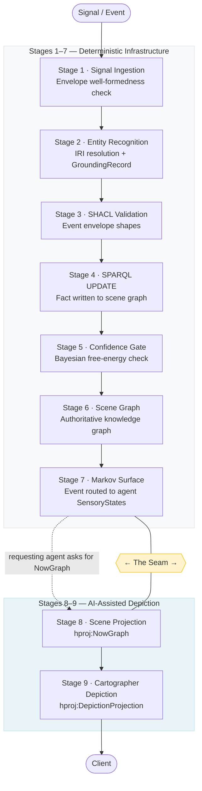

## § 0  How to Read This Primer

> *A practitioner's guide to the Holon Graph Architecture — what it is,
> why it was built, and how to use it.*

This document is a non-normative introduction to the Holon Graph Architecture
(HGA) for developers who already know their way around RDF and SHACL. It will
not teach you Turtle syntax or explain what a triple is. What it will do is
give you a working mental model of a moderately large specification in roughly
the time it takes to drink two cups of coffee.

HGA is a vocabulary, a pipeline, and an architectural pattern for building
knowledge graphs where structure, epistemic accountability, and AI-assisted
narration are first-class concerns. It is built on RDF 1.2, SHACL 1.2, and
SPARQL 1.2 — familiar ground — but it adds a layer of discipline that vanilla
RDF graphs typically lack: every node knows what it contains, every assertion
knows where it came from, and the AI reading the graph knows how to describe
what it sees.

Throughout this document a single example runs from beginning to end: a
hospital ward round. Dr Mei Chen, a physician in Ward 7, is reviewing patient
007 on a Tuesday morning. The knowledge graph that models this scenario starts
small — a handful of nodes and a single event — and accumulates layers as each
section introduces new concepts. By §12 the same handful of triples will be
the subject of a SHACL-validated event pipeline, a Markov blanket, a NowGraph
projection, and a camera-framed scene composite. Everything is connected; the
example grows with you.

**What this document is not.** The normative specification — the SHACL shapes,
the vocabulary declarations, the formal conformance requirements — lives in the
fifteen DataBook artefacts that constitute the HGA spec proper. This Primer
explains the *why* and the *how*; the DataBooks are the *what*. Cross-references
to specific DataBooks are given where relevant.

**Following along.** All code examples are valid RDF and can be loaded into any
conformant triplestore. The DataBook CLI (v1.4.4) and HolonBridge server provide
a reference implementation environment. That said, the Primer reads perfectly
well without running a single command — treat the code as illustration.

---

## § 1  The Problem HGA Solves

> *Three problems with knowledge graphs that vanilla RDF does not address —
> and the three answers HGA provides.*

Knowledge graphs built on plain RDF are excellent at storing facts. They are
considerably less good at answering questions like: who is responsible for this
subgraph? What does it mean for this node to contain that one? If two agents
assert contradictory things about the same entity, whose assertion takes
precedence, and how was that precedence established? And — the question that
matters most when you put an LLM in front of the graph — how do you tell the
model what it is looking at?

These are not edge cases. They are the central challenges of building
production knowledge graph systems with multiple contributing agents, mixed
provenance, and AI-generated outputs. HGA was designed to address them
systematically rather than leaving each deployment to invent its own solutions.

### The Structure Problem

RDF triples assert facts about named resources. They do not assert
*containment* — the idea that one thing is inside another, that the inside and
outside are meaningfully separated, and that what is inside belongs to the
container in a way that has governance implications. You can express
containment with a triple, of course: `ex:Ward7 ex:contains ex:Room7C`. But
that triple does not tell you anything about what it means to be inside Ward 7,
who may read or write the contents, or what rules apply at the boundary between
inside and outside.

HGA introduces the *holon* — a node that is simultaneously a whole (with its
own identity, properties, and interior structure) and a part (contained within
a parent holon, subject to its boundary conditions). The Holon model makes
containment a structural primitive rather than a convention. With it comes a
vocabulary for boundaries, portals, and the access conditions that govern
passage between holons. More on this in §2.

### The Provenance Problem

A knowledge graph that accepts assertions from multiple agents — sensors,
human annotators, automated pipelines, LLMs — will inevitably accumulate
conflicting, partial, and time-stamped claims. Vanilla RDF has no native
protocol for this. You can add PROV-O triples manually, but there is no
standard envelope model that every assertion carries, no pipeline that enforces
it, and no schema that validates it.

HGA addresses this with a typed event envelope model. Every state change that
enters the graph arrives as a structured event: an `hev:ObservationEvent`
(something was sensed), an `hev:AssertionEvent` (something is claimed to be
true), or an `hev:CommandEvent` (something is requested to change). Each
envelope carries routing metadata, temporal metadata, and a provenance trail
linking every asserted triple back to the activity that produced it. The
pipeline validates the envelope with SHACL before the assertion reaches the
scene graph. You always know where a fact came from. More on this in §§3–4.

### The Narration Problem

An LLM asked to "describe what is happening" in a knowledge graph receives,
by default, a wall of triples. It has no information about which triples are
most relevant, what the entities look like, how the scene should be framed, or
what the requesting agent is trying to understand. The results are technically
accurate and practically useless.

HGA addresses this with a two-stage output pipeline. Stage 8 produces a
*NowGraph* — a curated, depth-limited, provenance-annotated slice of the scene
graph, shaped for a specific agent and purpose. Stage 9 passes that slice to an
AI Cartographer, which reads a registered *PromptBlock* and produces a typed
*DepictionProjection* — prose, SVG, GeoJSON, or whatever format the client
requested. The Cartographer does not guess at relevance or framing; the graph
tells it exactly what to describe and how. More on this in §9.

None of these three problems requires a new graph database or a new query
language. HGA is built entirely on standard W3C stack components — RDF 1.2,
SHACL 1.2, SPARQL 1.2, OWL 2 RL, PROV-O, SKOS, and ODRL. What it adds is
discipline: a set of structural conventions and validation rules that make
multi-agent, AI-assisted knowledge graphs tractable in production.

---

## § 2  Holons: Wholes and Parts All the Way Down

> *The fundamental unit of HGA — a node that is simultaneously a whole and
> a part, with a declared boundary and navigable interior.*

The word *holon* was coined by Arthur Koestler in *The Ghost in the Machine*
(1967) to describe entities that are simultaneously self-contained wholes and
components of larger wholes. A cell is a holon: it is a complete, functioning
system with its own membrane and interior logic, and it is also a part of a
tissue, which is part of an organ, which is part of a body. The containment
relationship is real and consequential at every level; nothing is merely a
collection of parts, and nothing is merely a part.

HGA uses the holon as its fundamental graph node. An `holon:Holon` is a named
RDF resource that has an interior (things it contains), an exterior (the world
outside it), a boundary (what may pass between inside and outside), and a
registration status (whether it has been validated and accepted into the
registry). The containment hierarchy is navigable: from any holon you can move
up to its parent or down to its children, and the path from root to leaf is
always well-defined.

### The Four Holon Types

HGA defines four principal subclasses of `holon:Holon`, each capturing a
different mode of existence in the graph:

**`holon:AgentHolon`** is a holon that acts — it emits events, holds beliefs,
and participates in the pipeline as a first-person entity. In the ward example,
Dr Chen is an AgentHolon. So is the monitoring system that records patient
vitals. So is the AI Cartographer that generates the ward round depiction.
Agents have MarkovBlankets (§8) and may hold VerifiableCredentials (§6).

**`holon:PlaceHolon`** is a holon that exists somewhere — it has a spatial
or conceptual location, and other holons may be inside it. Ward 7 is a
PlaceHolon. Room 7C inside Ward 7 is a PlaceHolon. So is the hospital itself.
PlaceHolons establish the containment backbone of most real-world deployments.

**`holon:DataHolon`** is a holon that carries information — it is a named,
registered information resource with declared provenance and a lifecycle.
Patient 007's record is a DataHolon. So is the ward round depiction once it
has been validated and registered. DataHolons are the graph's persistent
artefacts.

**`holon:OrganisationHolon`** is a holon that coordinates agents — a team, a
department, an institution. The ward team is an OrganisationHolon whose members
include Dr Chen, the nursing staff, and the monitoring equipment.

### Containment and Membership

HGA distinguishes two kinds of "inside" relationship:

**`holon:contains`** is a structural containment relationship. Ward 7 contains
Room 7C. Room 7C contains the patient bed. Containment is hierarchical and
exclusive — a holon has exactly one parent container (or is a root holon with
none). The containment hierarchy is what gives the graph its holonic structure;
it is the backbone of SPARQL traversal patterns and the basis for projection
depth (how many levels to include in a NowGraph).

**`holon:hasMember`** is a participation relationship. Dr Chen is a member of
the ward team OrganisationHolon. She is not *contained* by the team — she
exists independently — but she *participates* in it. Membership is many-to-many
and does not imply exclusivity.

This distinction matters in practice. When you ask "what is inside Ward 7?"
you are traversing containment. When you ask "who is responsible for Ward 7?"
you are traversing membership. The same query should not confuse the two.

### Boundaries

Every holon has a `holon:Boundary` — a declaration of what may pass between
the holon's interior and the exterior world. The boundary is not a graph filter
(it does not hide triples from SPARQL queries); it is a *semantic contract*,
implemented as an ODRL policy and enforced by the portal access system (§6).

Think of it this way: the boundary of patient room 7C does not prevent you
from querying the triplestore for `<urn:holon:room-7c> ?p ?o`. It does declare
that a conformant HGA agent traversing the graph programmatically — one that
respects the portal and boundary model — must satisfy the declared access
conditions before receiving the room's contents as part of a NowGraph.

The `holon:HomeHolon` is the root of the containment hierarchy — the entire
holonic graph's anchor point. The `holon:IndexHolon` is the catalogue: a
named DataHolon that maintains the registry of all registered holons in the
deployment, their status, and their IRI assignments. Every HGA deployment has
exactly one HomeHolon and exactly one IndexHolon.

### The Ward Example

Here is the skeleton of the ward round knowledge graph, with no events, no
provenance, and no AI narration yet — just the holonic structure:

<!-- databook:id: primer-example-01 -->
<!-- mode=example norm=false -->
```turtle
@prefix holon:  <http://w3id.org/holon/> .
@prefix rdfs:   <http://www.w3.org/2000/01/rdf-schema#> .
@prefix xsd:    <http://www.w3.org/2001/XMLSchema#> .

# ── Ward 7 — the containing place ───────────────────────────────────────────

<urn:holon:ward-7>
    a holon:PlaceHolon ;
    rdfs:label       "Ward 7 — General Medical"@en ;
    holon:contains   <urn:holon:room-7c> , <urn:holon:nursing-station-7> ;
    holon:hasMember  <urn:holon:ward-team-7> ;
    holon:status     holon:RegisteredStatus .

# ── Room 7C — a place inside Ward 7 ─────────────────────────────────────────

<urn:holon:room-7c>
    a holon:PlaceHolon ;
    rdfs:label      "Room 7C"@en ;
    holon:contains  <urn:holon:patient-007> .

# ── Patient 007 — a data holon inside Room 7C ────────────────────────────────
# The patient record is the information artefact; the patient as a person
# would be an AgentHolon if they were a participating agent in the system.
# In this deployment, the record is what the graph models directly.

<urn:holon:patient-007>
    a holon:DataHolon ;
    rdfs:label      "Patient 007 — Ward Record"@en ;
    holon:status    holon:RegisteredStatus .

# ── Dr Chen — an agent, member of the ward team ─────────────────────────────

<urn:agent:ward-nurse-chen>
    a holon:AgentHolon ;
    rdfs:label      "Dr Mei Chen"@en ;
    holon:status    holon:RegisteredStatus .

# ── Ward team — an organisation, contains the agents ────────────────────────

<urn:holon:ward-team-7>
    a holon:OrganisationHolon ;
    rdfs:label      "Ward 7 Medical Team"@en ;
    holon:hasMember <urn:agent:ward-nurse-chen> .
```

Notice what is already true of this graph, even with no domain content at
all. We know that room 7C is inside Ward 7, that patient 007's record is inside
room 7C, that Dr Chen participates in the ward team, and that the ward team is
associated with Ward 7 through membership. The containment path from root to
record is `ward-7 → room-7c → patient-007`. A depth-2 NowGraph rooted at
`ward-7` will include all three containers and their direct properties.

The boundary declaration comes next. For now, the ward boundary simply states
that ward contents are accessible to registered ward team members:

<!-- databook:id: primer-example-02 -->
<!-- mode=example norm=false -->
```turtle
@prefix holon:  <http://w3id.org/holon/> .
@prefix hpol:   <http://w3id.org/holon/policy/> .
@prefix odrl:   <http://www.w3.org/ns/odrl/2/> .
@prefix rdfs:   <http://www.w3.org/2000/01/rdf-schema#> .

# ── Boundary on Ward 7 ───────────────────────────────────────────────────────
# Declares that the ward's interior contents are readable by registered
# ward team members. Writable only by treating agents with active
# VerifiableCredential attestation. The boundary itself is not a SPARQL
# filter — it is a semantic contract enforced at the portal layer.

<urn:boundary:ward-7>
    a holon:Boundary ;
    rdfs:label          "Ward 7 Boundary"@en ;
    holon:guardedHolon  <urn:holon:ward-7> ;
    hpol:readPolicy     <urn:policy:ward-team-read> ;
    hpol:writePolicy    <urn:policy:treating-agent-write> .

<urn:policy:ward-team-read>
    a odrl:Policy ;
    odrl:permission [
        odrl:action  odrl:read ;
        odrl:assignee <urn:holon:ward-team-7>
    ] .
```

This is the entire structural foundation that every subsequent layer builds on.
Ward 7 is a container with a boundary. Patient 007's record is inside it.
Dr Chen is a registered member of the team with read access. Nothing in the
graph has happened yet — no events have been processed, no assertions made.
That changes in §3.

---

## § 3  The Event Pipeline: Nine Stages from Signal to Depiction

> *Every fact that enters an HGA knowledge graph travels a declared path.
> Understanding that path is the key to understanding everything else.*

An HGA deployment is a pipeline, not a database. Data does not arrive by being
loaded; it arrives by being asserted. An assertion is an event. Events travel
through nine stages, each stage performing a specific transformation — from raw
signal to validated triple to curated scene slice to AI-narrated depiction. The
pipeline is the specification's central claim: that the path from real-world
observation to rendered understanding can be made formal, traceable, and
reproducible.

### The Nine Stages

**Stage 1 — Signal Ingestion.** The pipeline's entry point. Raw signals arrive
as typed event envelopes — from sensors, from human operators, from other
systems. At this stage the envelope is accepted or rejected based on basic
well-formedness: does it have a target holon? A declared type? A timestamp?
Malformed envelopes are rejected with an `hev:ViolationEvent` before they
touch the graph.

**Stage 2 — Entity Recognition.** Named entities in the event payload are
resolved to registered holon IRIs. A sensor reporting "patient in room 7C" is
mapped to `<urn:holon:patient-007>`. Unresolvable entities are flagged with
an `hev:UnresolvableTarget` event; the pipeline does not silently create new
nodes. The `holon:GroundingRecord` captures the resolution confidence and
match type for each entity.

**Stage 3 — SHACL Validation.** The event envelope is validated against the
appropriate SHACL shape. `hev:ObservationEvent` envelopes must have a
`hev:observedAt` timestamp and a well-formed payload reference.
`hev:AssertionEvent` envelopes must declare `hev:assertedAt` and a target
holon. Validation failures produce `hev:ViolationEvent` records attached to
the offending envelope via RDF 1.2 reification.

**Stage 4 — SPARQL UPDATE.** Validated assertions are written to the scene
graph as named triples in a named graph, with provenance annotations applied
via the RDF 1.2 reifier. This is the stage at which an event becomes a fact.
The triple's reifier carries the source event IRI, the asserting agent, and
the timestamp.

**Stage 5 — Confidence Gate.** The scene graph is checked against the
Bayesian conformance layer (if loaded). High free energy — unexpected
assertions that diverge sharply from the current belief state — may be
quarantined for human review rather than accepted immediately. For deployments
without the Bayesian layer, this stage passes through automatically.

**Stage 6 — Scene Graph.** The triplestore at this stage is the authoritative
knowledge graph. All assertions that have passed stages 1–5 are present,
provenance-tracked, and queryable. This is the ground truth of the deployment.

**Stage 7 — Markov Surface.** Events are routed to the sensory surfaces of
registered AgentHolons whose MarkovBlankets declare interest in the relevant
holon or event type. An `hev:ObservationEvent` targeting `<urn:holon:patient-007>`
reaches Dr Chen's SensoryState because her blanket's `hmk:receivesFrom`
includes the patient record holon. This is the mechanism by which agents
become aware of relevant state changes.

**Stage 8 — Scene Projection.** A requesting agent asks for a NowGraph — a
curated, depth-limited slice of the scene graph shaped for their identity and
purpose. The pipeline runs a SPARQL CONSTRUCT against the authoritative graph,
applies the declared filter shape, attaches active parameter bindings, and
produces an `hproj:NowGraph` resource. This is the AI Cartographer's input.

**Stage 9 — Cartographer Depiction.** The AI Cartographer receives the NowGraph
and a registered PromptBlock, and produces an `hproj:DepictionProjection` — the
rendered output delivered to the requesting client.

### The Seam

The most important architectural boundary in HGA is between stage 7 and
stage 8. It is not a technical boundary — the same triplestore and the same
SPARQL engine operate on both sides of it. It is an *epistemic* boundary.

Stages 1–7 are deterministic. Every operation is a formally specified SHACL
validation or SPARQL UPDATE. The same inputs always produce the same outputs.
The scene graph at stage 6 is authoritative: it reflects exactly and only what
has been asserted through the pipeline, with no interpretation.

Stages 8–9 are interpretive. The AI Cartographer reads the curated NowGraph
and produces a depiction that is *appropriate* to the requesting agent's
context, rendering mode, and declared purpose — but that is not *determined*
by the graph alone. The same NowGraph read by two different PromptBlocks may
produce two different depictions. That is a feature, not a defect.

The seam enforces a clear division of responsibility: the pipeline produces
ground truth; the Cartographer produces interpretation. This has a governance
consequence — and it is stated as a normative rule in the spec.

> **The read-only invariant:** An `hproj:Projection` MUST NOT generate a
> mutation event (`hev:AssertionEvent` or `hev:CommandEvent`) against its
> source holons. The Cartographer interprets; it does not write history.
> AI-generated content that should enter the graph must do so through a
> human-validated re-ingestion at stage 1, not through the depiction pipeline.

This single rule separates HGA from systems where an LLM can silently modify
the knowledge graph it is narrating. More on the AI governance implications
of this design in §10.

### Pipeline Diagram

<!-- databook:id: primer-pipeline-diagram -->
<!-- mode=example norm=false -->


### The Ward Round Enters the Pipeline

With the pipeline structure in mind, here is what happens when Dr Chen's
monitoring station detects a blood pressure reading for patient 007. The
monitoring system emits an observation event at stage 1:

<!-- databook:id: primer-example-03 -->
<!-- mode=example norm=false -->
```turtle
@prefix hev:  <http://w3id.org/holon/event/> .
@prefix rdfs: <http://www.w3.org/2000/01/rdf-schema#> .
@prefix xsd:  <http://www.w3.org/2001/XMLSchema#> .

# ── Stage 1: An ObservationEvent arrives from the monitoring system ──────────
# The envelope declares type, target, and timing.
# The payload (the actual blood pressure value) is a separate named graph
# reference — the envelope does not constrain its content.

<urn:event:obs-bp-007-001>
    a hev:ObservationEvent ;
    rdfs:label        "Blood pressure observation — patient 007"@en ;
    hev:targetHolon   <urn:holon:patient-007> ;
    hev:assertedAt    "2026-06-09T09:00:03Z"^^xsd:dateTime ;
    hev:receivedAt    "2026-06-09T09:00:04Z"^^xsd:dateTime ;
    hev:sourceAgent   <urn:agent:monitoring-system-7c> ;
    hev:payloadGraph  <urn:graph:payload-bp-007-001> .

# ── The payload graph — not constrained by hev: shapes ──────────────────────

<urn:graph:payload-bp-007-001> {
    <urn:holon:patient-007>
        <urn:prop:systolicBP>  118 ;
        <urn:prop:diastolicBP>  76 ;
        <urn:prop:bpUnit>      "mmHg" .
}
```

After stages 2–4, the blood pressure values are in the scene graph as
validated triples with full provenance. The monitoring system's IRI has been
resolved, the envelope has passed SHACL validation, and the SPARQL UPDATE has
run. What the scene graph contains at stage 6 looks like this:

<!-- databook:id: primer-example-04 -->
<!-- mode=example norm=false -->
```turtle12
VERSION "1.2"
PREFIX holon:  <http://w3id.org/holon/>
PREFIX hev:    <http://w3id.org/holon/event/>
PREFIX hprov:  <http://w3id.org/holon/provenance/>
PREFIX prov:   <http://www.w3.org/ns/prov#>
PREFIX rdfs:   <http://www.w3.org/2000/01/rdf-schema#>
PREFIX xsd:    <http://www.w3.org/2001/XMLSchema#>

# ── Scene graph — the triple now has a named reifier carrying provenance ─────
# The reifier IRI is generated by the pipeline from the source event.
# The triple itself is exactly what the payload said; the reifier records
# where it came from.

<urn:holon:patient-007>
    <urn:prop:systolicBP> 118
    ~ <urn:reifier:bp-007-001-systolic>
    {| rdfs:label    "Systolic BP — patient 007, 09:00:03Z"@en ;
       prov:wasGeneratedBy <urn:activity:ingest-obs-bp-007-001> ;
       hev:sourceEvent    <urn:event:obs-bp-007-001> ;
       hev:assertedAt     "2026-06-09T09:00:03Z"^^xsd:dateTime |} .

# ── The ingestion activity — the pipeline run that produced this triple ──────

<urn:activity:ingest-obs-bp-007-001>
    a hprov:IngestionActivity ;
    rdfs:label          "Ingest observation bp-007-001"@en ;
    prov:startedAtTime  "2026-06-09T09:00:04Z"^^xsd:dateTime ;
    prov:endedAtTime    "2026-06-09T09:00:04Z"^^xsd:dateTime ;
    prov:wasAssociatedWith <urn:agent:monitoring-system-7c> .
```

The blood pressure reading is now a fact in the knowledge graph. It has a
stable IRI for its reifier, a provenance trail back to the source observation,
and a timestamp. Anyone querying the graph later — including the AI Cartographer
in stage 9 — knows exactly when this fact was asserted, by which system, and
in response to which event. That auditability is not optional in HGA; it is
what the pipeline enforces at every stage.

---

## § 4  Events: The Language of State Change

> *HGA has three ways to say something happened. Understanding the distinction
> between them is the foundation of the input-side model.*

RDF is a language for asserting what is true. HGA is also a language for
asserting *what happened*, *what was requested to happen*, and *what was
observed*. These are different speech acts, and HGA represents them
differently. The event vocabulary (`hev:`) provides the grammar.

### Three Event Types

**`hev:ObservationEvent`** is a report from a sensor or agent about something
that was perceived. It does not assert that the perception is correct — only
that it occurred. The monitoring system reports a blood pressure reading; that
is an observation. Observations are low-trust by default: they arrive from
external sources and must pass through the pipeline before they become
authoritative facts. The critical property is `hev:observedAt` — the timestamp
of the actual measurement, which may differ from `hev:receivedAt` when there
is transmission latency.

**`hev:AssertionEvent`** is a claim that something is true, made by a
registered agent with declared authority. When the pipeline processes an
observation and produces a validated scene graph update, it generates an
AssertionEvent whose asserting agent is the pipeline itself or a designated
validation authority. When Dr Chen adds a clinical note — "patient condition
stable, continue current regime" — that is an AssertionEvent authored by her
agent IRI. Assertions are higher-trust than observations: they have passed
either through the automated pipeline or through a deliberate human act of
authorship.

**`hev:CommandEvent`** is a request for a state change — it asks for something
to happen rather than asserting that it has. "Administer 10mg of medication X"
is a CommandEvent. Commands are routed to the agent holons that own the
commanded resource. If the command passes the boundary policy on the target
holon, it may generate a downstream AssertionEvent ("medication X administered
at 09:15"). If it fails, the pipeline generates an `hev:CommandRejected` event
with the policy violation reason attached.

### The Envelope / Payload Invariant

Every HGA event is an envelope wrapped around a payload. This distinction is
architecturally critical and worth stating precisely:

The **envelope** is the part the pipeline validates. It carries:
- The event type (`rdf:type`)
- The target holon (`hev:targetHolon`)
- Temporal metadata (`hev:assertedAt`, `hev:receivedAt`, `hev:expiresAt`)
- The asserting agent (`hev:sourceAgent`)
- A reference to the payload graph (`hev:payloadGraph`)

The **payload** is the domain content — the blood pressure values, the clinical
note text, the medication instruction. The payload lives in a separate named
graph referenced by the envelope. HGA shapes validate the envelope and *only*
the envelope. The payload is opaque to the pipeline; domain-specific shapes
validate it separately, if at all.

This separation has a practical consequence: the event vocabulary does not
change when the domain changes. The same `hev:AssertionEvent` envelope that
carries a blood pressure reading in a hospital deployment carries a
geospatial coordinate in a geodetic deployment and a supply chain status in a
logistics deployment. The envelope is infrastructure; the payload is content.

> **Closed envelope, open payload.** The SHACL shapes for event envelopes are
> `sh:closed true` — no additional properties are permitted in the envelope
> layer. The payload named graph has no such restriction. If you find yourself
> wanting to add a domain property directly to the event envelope, the correct
> move is to put it in the payload and add a well-typed reference in the
> envelope to find it.

### Temporal Properties

Four timestamps matter in the HGA event model, and they are not interchangeable:

**`hev:assertedAt`** is when the fact was claimed to be true. For an
ObservationEvent, this is when the sensor took its measurement. For a human
AssertionEvent, it is when the author made the claim. This timestamp travels
with the assertion all the way to the reifier in the scene graph — it is the
fact's official timestamp in the knowledge graph.

**`hev:receivedAt`** is when the event arrived at the pipeline. It may differ
from `assertedAt` due to network latency, batching, or delayed submission. The
difference between the two is informative: a large gap may indicate a
connectivity problem or a backdated assertion.

**`hev:expiresAt`** declares when the assertion should no longer be considered
current. Not all facts expire, but many do: a blood pressure reading is stale
after a few minutes; a diagnostic code may be valid for months. Processors
SHOULD NOT include expired assertions in NowGraphs without explicit instruction
to do so.

**`hev:validAsOf`** is a point-in-time anchor for historical queries. "What
did the graph assert about patient 007's blood pressure as of 08:45?" A NowGraph
rooted at a past `validAsOf` timestamp gives you a snapshot of the graph's
state at that moment — the foundation of the Cinematic rendering mode (§9).

### System-Generated Events

The pipeline generates its own events in response to processing outcomes.
These are diagnostic signals, not application-level data, but they are
first-class HGA events with full provenance:

- **`hev:CommandRejected`** — a CommandEvent failed the target holon's
  boundary policy. Carries a `hev:rejectionReason` pointing to the ODRL
  policy that blocked it.
- **`hev:ViolationEvent`** — a SHACL shape produced a Violation result.
  Attached to the offending event via RDF 1.2 reification, not via a
  separate triple, so the violation is co-located with its cause in the graph.
- **`hev:UnresolvableTarget`** — entity recognition failed for one or more
  entities in the payload. The assertion is held pending resolution or
  discarded after `hev:expiresAt`.
- **`hev:OutOfBounds`** — a CommandEvent targeted a holon outside the
  commanding agent's authorised scope.

### RDF 1.2 Reification in Practice

HGA uses RDF 1.2 annotated triples rather than RDF-star reification or
`rdf:Statement` patterns. The Turtle 1.2 syntax is `?subject ?predicate
?object ~ <reifier-iri>`, followed by a `{| ... |}` block of annotations
on the reifier.

The reason for this choice is stability: the reifier IRI is a named,
dereferenceable resource that can be the subject of further assertions. You
can annotate the annotation. You can query for all triples asserted by a
specific agent with `?reifier hev:sourceEvent ?event` without materialising
additional triples. And the reifier IRI can appear in provenance records as
a `prov:Entity`, linking seamlessly into the PROV-O trail.

Here are the two ward round events side by side — the ObservationEvent from
the monitoring system, and the AssertionEvent generated by the pipeline after
validation:

<!-- databook:id: primer-example-05 -->
<!-- mode=example norm=false -->
```turtle
@prefix hev:  <http://w3id.org/holon/event/> .
@prefix rdfs: <http://www.w3.org/2000/01/rdf-schema#> .
@prefix xsd:  <http://www.w3.org/2001/XMLSchema#> .

# ── ObservationEvent — from the monitoring system ───────────────────────────
# Low-trust. Reports a sensor reading. Not yet a fact in the graph.

<urn:event:obs-bp-007-001>
    a hev:ObservationEvent ;
    rdfs:label          "Blood pressure observation — patient 007"@en ;
    hev:targetHolon     <urn:holon:patient-007> ;
    hev:assertedAt      "2026-06-09T09:00:03Z"^^xsd:dateTime ;
    hev:receivedAt      "2026-06-09T09:00:04Z"^^xsd:dateTime ;
    hev:expiresAt       "2026-06-09T09:05:03Z"^^xsd:dateTime ;
    hev:sourceAgent     <urn:agent:monitoring-system-7c> ;
    hev:payloadGraph    <urn:graph:payload-bp-007-001> .
```

<!-- databook:id: primer-example-06 -->
<!-- mode=example norm=false -->
```turtle12
VERSION "1.2"
PREFIX hev:   <http://w3id.org/holon/event/>
PREFIX prov:  <http://www.w3.org/ns/prov#>
PREFIX rdfs:  <http://www.w3.org/2000/01/rdf-schema#>
PREFIX xsd:   <http://www.w3.org/2001/XMLSchema#>

# ── AssertionEvent — generated by the pipeline after stages 2–4 ─────────────
# Higher-trust. Declares that the pipeline has validated and accepted the
# observation. sourceAgent is now the pipeline itself, not the sensor.

<urn:event:assert-bp-007-001>
    a hev:AssertionEvent ;
    rdfs:label          "Blood pressure assertion — patient 007 stable"@en ;
    hev:targetHolon     <urn:holon:patient-007> ;
    hev:assertedAt      "2026-06-09T09:00:04Z"^^xsd:dateTime ;
    hev:receivedAt      "2026-06-09T09:00:04Z"^^xsd:dateTime ;
    hev:expiresAt       "2026-06-09T09:05:03Z"^^xsd:dateTime ;
    hev:sourceAgent     <urn:agent:hga-pipeline-ward7> ;
    hev:derivedFrom     <urn:event:obs-bp-007-001> ;
    hev:payloadGraph    <urn:graph:payload-bp-007-001> .

# ── The scene graph triple, with reifier carrying provenance ─────────────────
# The reifier is named so that it can itself be queried and annotated.

<urn:holon:patient-007>
    <urn:prop:systolicBP> 118
    ~ <urn:reifier:bp-007-001-systolic>
    {| rdfs:label          "Systolic BP 118 — patient 007"@en ;
       hev:sourceEvent     <urn:event:assert-bp-007-001> ;
       hev:assertedAt      "2026-06-09T09:00:04Z"^^xsd:dateTime ;
       prov:wasGeneratedBy <urn:activity:ingest-obs-bp-007-001> |} .
```

Two events, two trust levels, one fact in the graph. The ObservationEvent is
the raw signal; the AssertionEvent is the pipeline's validated acceptance of
that signal as a ground-truth claim. Both are preserved — you can always trace
the path from scene graph fact back to its originating sensor reading, and
from the sensor reading forward to every fact it produced.

The ward round now has structure (§2) and a validated blood pressure fact with
a full provenance trail (§§3–4). In §5 we look at what that provenance trail
actually contains — and why the design makes certain regulatory requirements
remarkably straightforward to satisfy.

---

## § 5  Provenance: Every Assertion Carries a Trail

> *In a knowledge graph where multiple agents assert facts, the question
> "who said this, and when?" is not a nice-to-have. It is the foundation
> of trustworthiness.*

The blood pressure reading from the previous section is now a triple in the
scene graph. But consider what a healthcare auditor — or a second clinical
system cross-checking the record — actually needs to know about that triple.
Not just that the value is 118. That the value came from a specific monitoring
unit, processed by a specific pipeline instance, at a specific time, in
response to a specific sensor event that can be retrieved and re-examined.
That the chain from raw signal to authoritative graph fact is unbroken and
independently verifiable.

This is the HGA provenance contract: every triple that enters the scene graph
via the pipeline carries a named reifier whose annotations provide exactly that
chain. The reifier is not optional metadata appended for convenience — it is
generated by stage 4 and required by the SHACL shapes on any downstream
NowGraph that makes claims about the triple's source.

### IngestionActivity

The anchor of the provenance trail is the `hprov:IngestionActivity` — the
named record of the pipeline run that produced the triple. It declares:

- `prov:startedAtTime` and `prov:endedAtTime` — the processing window
- `prov:wasAssociatedWith` — the agent (human, sensor, or automated pipeline)
  that submitted the input event
- `hprov:transformerType` — whether the processor was a SPARQL transformer,
  an LLM, a rule engine, or a human annotator
- `hprov:transformerIRI` — the specific processor IRI, including version if
  applicable

For automated ingestion this is generated mechanically. For LLM-generated
assertions — content produced by the AI Cartographer that has been validated
and re-ingested — the `hprov:transformerType` is `hprov:LLMTransformer` and
`hprov:transformerIRI` identifies the specific model version. This is the
mechanism by which the audit trail remains valid even when AI systems
contribute content to the graph.

### Why This Is Not Bureaucratic Overhead

Provenance at this level is frequently dismissed as compliance boilerplate —
something you add because a regulation requires it, not because it helps.
HGA's view is the opposite. A knowledge graph without assertion-level
provenance is a graph you cannot trust as it ages.

Consider what happens after three months of ward round data. Without
provenance, you have a graph full of blood pressure readings with no way to
determine which came from the calibrated monitoring unit, which were manually
entered by a staff member, and which were imported from an external system
with different measurement conventions. With provenance, that distinction is a
two-line SPARQL query. Conflict detection — identifying cases where two agents
have made contradictory assertions about the same fact — is equally
straightforward: find reifiers on the same triple from different asserting
agents and compare their timestamps and trust levels.

In regulated domains, this is not optional. In any domain where the graph is
expected to remain trustworthy over time, it is good engineering.

### The Provenance Block in a NowGraph

When the AI Cartographer receives a NowGraph at stage 8, the NowGraph carries
a `hproj:provenanceBlock` — a named graph containing the provenance trail for
all assertions in scope. The Cartographer can read this block to attribute
statements accurately: "according to the monitoring system at 09:00:03" rather
than a confident but unattributed declarative.

This also provides the foundation for the read-only invariant introduced in §3.
If the Cartographer produced a mutation event, it would need to appear in the
provenance trail as an asserting agent — a trail that would be structurally
indistinguishable from a human assertion. Prohibiting Cartographer-generated
mutations means the trail remains clean: AI contributions are always marked as
`hprov:LLMTransformer` depictions, never as `hprov:HumanAnnotator` assertions.

Here is the complete provenance trail for the ward round blood pressure
assertion — the IngestionActivity, its associations, and the transformer
attribution:

<!-- databook:id: primer-example-07 -->
<!-- mode=example norm=false -->
```turtle
@prefix hprov:  <http://w3id.org/holon/provenance/> .
@prefix prov:   <http://www.w3.org/ns/prov#> .
@prefix rdfs:   <http://www.w3.org/2000/01/rdf-schema#> .
@prefix xsd:    <http://www.w3.org/2001/XMLSchema#> .

# ── The ingestion activity — the pipeline run that produced the BP triple ────

<urn:activity:ingest-obs-bp-007-001>
    a hprov:IngestionActivity ;
    rdfs:label               "Ingest BP observation — patient 007, 09:00:04Z"@en ;
    prov:startedAtTime       "2026-06-09T09:00:04Z"^^xsd:dateTime ;
    prov:endedAtTime         "2026-06-09T09:00:04Z"^^xsd:dateTime ;
    prov:wasAssociatedWith   <urn:agent:monitoring-system-7c> ;
    prov:used                <urn:event:obs-bp-007-001> ;
    hprov:transformerType    hprov:SPARQLTransformer ;
    hprov:transformerIRI     <urn:pipeline:hga-ward7-ingest-v2.1> ;
    hprov:inputEvent         <urn:event:obs-bp-007-001> ;
    hprov:outputGraph        <urn:graph:scene-ward7> .

# ── The asserting agent — the monitoring device ──────────────────────────────

<urn:agent:monitoring-system-7c>
    a holon:AgentHolon ;
    rdfs:label               "Room 7C Cardiac Monitor"@en ;
    hprov:trustLevel         hprov:SensorTrust ;
    prov:wasAttributedTo     <urn:holon:ward-team-7> .

# ── The provenance trail on the reifier — links triple to activity ───────────
# This is what the NowGraph's provenanceBlock carries for every in-scope triple.

<urn:reifier:bp-007-001-systolic>
    a prov:Entity ;
    prov:wasGeneratedBy    <urn:activity:ingest-obs-bp-007-001> ;
    prov:wasAttributedTo   <urn:agent:monitoring-system-7c> ;
    prov:wasDerivedFrom    <urn:event:obs-bp-007-001> .
```

The complete trail is now navigable in both directions: from the blood pressure
value in the scene graph up through the reifier to the IngestionActivity and
back to the originating ObservationEvent; and from the ObservationEvent
forward through the activity to every triple it produced. A SPARQL query over
this trail can answer regulatory questions that would otherwise require manual
record reconstruction.

---

## § 6  Portals, Boundaries, and Policy

> *Holons are separated by boundaries and connected by portals. What may pass
> depends on declared policy, not on query-level access controls.*

Ward 7's patient records are sensitive. Dr Chen may read any record in the
ward because she is a registered member of the ward team. A visiting consultant
may read the records of patients under her care but not others. A billing
system may read insurance and demographic data but must not see clinical notes.
These are not technical access controls on the SPARQL endpoint — they are
semantic declarations about what a conformant HGA agent is permitted to do when
navigating the holonic graph.

HGA models access at two levels: the `holon:Boundary` declares what may pass
between the inside and outside of a holon in general; the `holon:Portal`
declares a specific directed navigational link and its traversal conditions.
Together they form the policy layer — a vocabulary for saying not just *what
exists* in the graph but *who may see it* and *under what conditions*.

### Portals

A `holon:Portal` is a named, directed link from one holon to another. It is
not simply the containment relationship (`holon:contains`) — it is an
explicitly registered navigational path with declared traversal conditions,
a declared state (open, locked, suspended), and a `holon:PortalLock` that
governs the conditions under which it may be traversed.

Think of a portal as a doorway with a documented access policy. The doorway
exists independently of whether anyone is currently walking through it.
Its policy is a formal ODRL permission declaration that the pipeline evaluates
when an agent requests a NowGraph that would cross the portal. If the agent
satisfies the permission conditions, the portal is traversable and the
destination holon's contents are included in the NowGraph. If not, the
destination is excluded and an `hev:CommandRejected` event is generated —
not a silent omission, but a recorded access decision.

This has a significant implication for the AI Cartographer. If the NowGraph
for Dr Chen's ward round does not include room 7B because the portal to
room 7B is locked for her current session, the Cartographer's depiction is
not *wrong* — it accurately reflects what the requesting agent was permitted
to see. The provenance trail records the access decision. The graph's
integrity is maintained regardless of what any individual agent can observe.

### Boundaries

A `holon:Boundary` is a broader declaration attached to a holon rather than to
a specific portal. Where a portal governs one directed path, a boundary
governs the holon's entire perimeter — all reads and writes to its interior
contents.

The critical design decision, worth restating from §2, is that the boundary
is a *semantic contract*, not a SPARQL filter. A boundary declaration does not
alter the triplestore's response to arbitrary SPARQL queries from a client
with direct database access. It declares what a conformant HGA agent — one
that respects the portal and boundary model — is permitted to request. This
is the appropriate layer for organisational policy: it is the graph stating
its own access rules in formal vocabulary, not the infrastructure enforcing
them through query rewriting.

Deployments that require enforcement at the infrastructure level can implement
it independently; the boundary vocabulary provides the formal basis for that
enforcement without mandating any specific mechanism.

### ODRL Policy in One Paragraph

HGA uses ODRL 2.2 (the W3C Open Digital Rights Language) as the policy
declaration vocabulary. An ODRL `odrl:Permission` declares an `odrl:action`
(read, write, annotate) and an `odrl:assignee` (the agent or group permitted
to perform it). Permissions are attached to portals and boundaries via the
`hpol:` vocabulary. HGA validates the structure of the policy attachment —
that permissions have the required fields, that assignees reference registered
agent IRIs — but does not interpret the ODRL semantics itself. Domain
deployments implement ODRL evaluation according to their own requirements.
The vocabulary provides the formal expression; the runtime provides the
enforcement.

### Verifiable Credentials

For access conditions that depend on verified identity attributes — "only
attending physicians with active medical licence credentials may write clinical
notes" — the `hvc:` vocabulary provides VC Data Model 2.0 wrapper shapes. An
agent presents a `vc:VerifiableCredential` attesting the relevant attribute;
the portal's ODRL permission declares that attribute as an access condition;
the pipeline evaluates whether the agent's credential satisfies it.

The VC shapes are intentionally open on the `credentialSubject` — HGA
validates the credential wrapper (issuer, validFrom, proof structure) but not
the domain-specific subject content. A clinical licence credential and a
security clearance credential use the same wrapper shapes; only their subjects
differ.

### The Ward Portals

Here is the portal model for Ward 7, expressed in Turtle. Portal 1 governs
movement from the ward corridor into patient rooms. Portal 2 governs access
to individual patient records. The boundary on the patient record requires a
`PortalLock` for write access:

<!-- databook:id: primer-example-08 -->
<!-- mode=example norm=false -->
```turtle
@prefix holon:  <http://w3id.org/holon/> .
@prefix hpol:   <http://w3id.org/holon/policy/> .
@prefix odrl:   <http://www.w3.org/ns/odrl/2/> .
@prefix rdfs:   <http://www.w3.org/2000/01/rdf-schema#> .

# ── Portal from ward corridor into room 7C ───────────────────────────────────
# Any registered ward team member may traverse this portal for read.

<urn:portal:corridor-to-7c>
    a holon:Portal ;
    rdfs:label              "Corridor → Room 7C portal"@en ;
    holon:portalFrom        <urn:holon:ward-7-corridor> ;
    holon:portalTo          <urn:holon:room-7c> ;
    holon:portalState       holon:PortalOpen ;
    hpol:traversalPolicy    <urn:policy:ward-team-read> .

<urn:policy:ward-team-read>
    a odrl:Policy ;
    odrl:permission [
        odrl:action     odrl:read ;
        odrl:assignee   <urn:holon:ward-team-7>
    ] .

# ── Portal from room 7C into the patient record ──────────────────────────────
# Read: any ward team member. Write: treating agent with active session credential.

<urn:portal:room-to-patient-record>
    a holon:Portal ;
    rdfs:label              "Room 7C → Patient 007 record portal"@en ;
    holon:portalFrom        <urn:holon:room-7c> ;
    holon:portalTo          <urn:holon:patient-007> ;
    holon:portalState       holon:PortalOpen ;
    hpol:traversalPolicy    <urn:policy:ward-team-read> ;
    holon:portalLock        <urn:lock:patient-record-write> .
```

<!-- databook:id: primer-example-09 -->
<!-- mode=example norm=false -->
```turtle
@prefix holon:  <http://w3id.org/holon/> .
@prefix hpol:   <http://w3id.org/holon/policy/> .
@prefix hvc:    <http://w3id.org/holon/vc/> .
@prefix odrl:   <http://www.w3.org/ns/odrl/2/> .
@prefix vc:     <https://www.w3.org/ns/credentials/> .
@prefix rdfs:   <http://www.w3.org/2000/01/rdf-schema#> .

# ── PortalLock — write access requires an active treating-agent credential ───

<urn:lock:patient-record-write>
    a holon:PortalLock ;
    rdfs:label              "Patient record write lock"@en ;
    holon:lockedPortal      <urn:portal:room-to-patient-record> ;
    hpol:unlockPolicy       <urn:policy:treating-agent-write> .

<urn:policy:treating-agent-write>
    a odrl:Policy ;
    odrl:permission [
        odrl:action     odrl:write ;
        odrl:assignee   <urn:agent:ward-nurse-chen> ;
        odrl:constraint [
            odrl:leftOperand  <urn:operand:credentialType> ;
            odrl:operator     odrl:eq ;
            odrl:rightOperand <urn:credential-type:treating-agent-session>
        ]
    ] .

# ── Dr Chen's treating-agent credential for this session ─────────────────────
# Issued by the ward management system; valid for the duration of the ward round.

<urn:vc:chen-treating-agent-2026-06-09>
    a vc:VerifiableCredential ;
    vc:issuer           <urn:holon:hospital-credentialing> ;
    vc:validFrom        "2026-06-09T08:00:00Z" ;
    vc:validUntil       "2026-06-09T18:00:00Z" ;
    vc:credentialSubject [
        a <urn:credential-type:treating-agent-session> ;
        <urn:prop:forWard>    <urn:holon:ward-7> ;
        <urn:prop:forAgent>   <urn:agent:ward-nurse-chen>
    ] .
```

Dr Chen holds a valid treating-agent credential for today's shift. The portal
lock's ODRL constraint requires exactly that credential type. The pipeline
evaluates the constraint at the time of a CommandEvent targeting the patient
record and either allows the write or produces a `hev:CommandRejected` event
with the policy violation attached as a reifier annotation.

The structure we have at this point is complete as a holonic knowledge graph.
Ward 7 has a spatial hierarchy (§2), a validated blood pressure fact with full
provenance (§§3–5), and a navigable policy layer that governs who may see and
change what (§6). The next layer — §7 — introduces uncertainty and belief, for
deployments where the graph needs to model not just what is known but how
confident the knowing agents are in what they know.

---

## § 7  The Bayesian Layer: Uncertainty as First-Class Data

> *A fact in a knowledge graph is rarely either true or false. It is held
> with a certain degree of confidence, which changes as evidence accumulates.*

The blood pressure reading from §§3–4 arrived from a monitoring sensor and
was accepted by the pipeline. But confidence in that reading is not binary. The
sensor has a calibration history. The reading might be an outlier for this
patient. A second reading five minutes later might confirm or contradict it.
The clinical system needs to reason about the reading's reliability, not just
record it.

Vanilla RDF has no mechanism for this. You can add a `ex:confidence 0.91`
triple, but that triple is itself unqualified — you cannot attach provenance to
it, express its derivation from a prior, or update it as evidence accumulates
without creating additional triples and managing their lifecycle by hand.

HGA addresses this with three optional structures from the `hbayes:`
vocabulary, each implemented as a named reifier annotation on the relevant
triple. They can be loaded independently of the rest of the pipeline. They do
not change how SHACL validation works or how events are routed. They add a
semantically precise layer of uncertainty tracking that integrates cleanly with
the provenance model already in place.

> **At-risk note.** The `hbayes:` conformance class is marked at-risk pending
> stabilisation. All Bayesian SHACL rules have SPARQL UPDATE fallbacks in
> the spec annex. If you do not need belief-state tracking, skip to §8 — the
> rest of the pipeline operates without it.

### BeliefState

A `hbayes:BeliefState` is a reifier annotation on a specific triple recording
three values:

- `hbayes:prior` — the probability that this triple was true *before* the
  current observation arrived, based on historical data or initialised
  defaults
- `hbayes:posterior` — the updated probability *after* the observation
- `hbayes:precision` — the inverse variance of the belief, expressing how
  sharply the distribution is peaked; high precision means high confidence
  in the posterior, not merely a high posterior value

For the blood pressure reading, the prior reflects the patient's baseline
history. If patient 007 has consistently read between 110 and 125 systolic,
a reading of 118 is expected and the posterior is high. If he has been reading
145 for the past two days, a reading of 118 is surprising and the posterior
update is larger — the model has moved significantly.

### FreeEnergy

`hbayes:FreeEnergy` records the information-theoretic cost of the belief
update: how surprised the agent was by this observation. It decomposes into
two components:

- `hbayes:complexity` — how much the agent's internal model had to change
  to accommodate the new data (the KL divergence between prior and posterior)
- `hbayes:accuracy` — how well the new belief state predicts the observation

High free energy signals a surprising observation — one that sits far from
what the agent's generative model predicted. In a production system, a pattern
of high free energy on a particular sensor's readings is a signal that the
sensor may be malfunctioning, that the patient's condition has changed
significantly, or that the model's priors are miscalibrated. That signal is
native to the graph and queryable with standard SPARQL.

### PolicySelection

When an agent can respond to an observation in multiple ways —  continue
monitoring, escalate to a physician, administer a protocol — `hbayes:PolicySelection`
records which response was chosen and why. The selection criterion is minimum
expected free energy: among all available responses, the agent chooses the one
that minimises the expected surprise of future observations given that response.
This is the formal basis for the active inference connection introduced in §10.

Here is the BeliefState annotation on the blood pressure triple from §4,
adding Bayesian confidence to the existing provenance trail:

<!-- databook:id: primer-example-10 -->
<!-- mode=example norm=false -->
```turtle12
VERSION "1.2"
PREFIX hbayes:  <http://w3id.org/holon/bayesian/>
PREFIX hev:     <http://w3id.org/holon/event/>
PREFIX prov:    <http://www.w3.org/ns/prov#>
PREFIX rdfs:    <http://www.w3.org/2000/01/rdf-schema#>
PREFIX xsd:     <http://www.w3.org/2001/XMLSchema#>

# ── The same blood pressure triple from §4, now with a BeliefState reifier ───
# The provenance annotations from §4 (sourceEvent, assertedAt, wasGeneratedBy)
# are still present on the same reifier. The Bayesian annotations extend them.

<urn:holon:patient-007>
    <urn:prop:systolicBP> 118
    ~ <urn:reifier:bp-007-001-systolic>
    {| rdfs:label          "Systolic BP 118 — patient 007"@en ;
       hev:sourceEvent     <urn:event:assert-bp-007-001> ;
       hev:assertedAt      "2026-06-09T09:00:04Z"^^xsd:dateTime ;
       prov:wasGeneratedBy <urn:activity:ingest-obs-bp-007-001> ;

       # Bayesian layer — how confident are we in this reading?
       hbayes:prior        "0.74"^^xsd:decimal ;
       hbayes:posterior    "0.91"^^xsd:decimal ;
       hbayes:precision    "0.87"^^xsd:decimal |} .

# ── FreeEnergy record — how surprising was this observation? ─────────────────
# Low complexity (small model update), high accuracy (reading fits the updated
# model well). Total free energy 0.19 — consistent with patient's recent trend.

<urn:belief:bp-007-001-systolic>
    a hbayes:FreeEnergy ;
    hbayes:forReifier   <urn:reifier:bp-007-001-systolic> ;
    hbayes:complexity   "0.07"^^xsd:decimal ;
    hbayes:accuracy     "0.88"^^xsd:decimal ;
    hbayes:freeEnergy   "0.19"^^xsd:decimal .
```

The blood pressure reading was not surprising — free energy 0.19, posterior
0.91. Patient 007 is stable and the monitoring system's model reflects that.
If the next reading were 165 systolic, the free energy would spike, the
posterior would drop, and the pattern would be queryable with a single SPARQL
filter on `hbayes:freeEnergy`. That is what it means for uncertainty to be
first-class data.

---

## § 8  The Markov Blanket: Agents That Know What They Know

> *Every agent in an HGA graph has an explicit epistemic boundary — a formal
> declaration of what it perceives, what it emits, and what it keeps private.*

Dr Chen is not a passive data repository. She receives information — from
monitors, from clinical notes, from conversations. She makes assessments — she
*believes* things about patient 007's condition, beliefs that are private to
her clinical judgment. She communicates — she writes notes, gives instructions,
produces the ward round depiction. These three activities are distinct, and HGA
represents them with three distinct surfaces of a formal structure called a
Markov blanket.

The concept comes from Karl Friston's work on the Free Energy Principle in
cognitive science: a Markov blanket is the minimal set of states that separates
a system's internal states from its environment. Everything the system knows
about the world is mediated through its blanket. The inside and outside are
conditionally independent given the blanket — the external world influences the
system only through what the sensory surface receives, and the system influences
the world only through what the active surface emits.

HGA makes this formal as a graph structure. An `hmk:MarkovBlanket` resource
partitions agent-related states into four surfaces, each a distinct named
resource:

### The Four Surfaces

**`hmk:SensoryState`** — the inward-facing surface. Sensory states receive
`hev:ObservationEvent` payloads from the environment. Dr Chen's sensory states
include her reception of monitor readings, clinical notes authored by
colleagues, and alerts generated by the pipeline. Everything she *knows* about
the world arrived through a SensoryState. The sensory surface is *written by
the environment and read by the internal model.*

**`hmk:InternalState`** — the private interior. Internal states are Dr Chen's
beliefs, assessments, and generative model. They are not directly accessible
to external agents — a conformant HGA system will not include a physician's
InternalState in a NowGraph requested by a billing system. The only access to
internal state from outside is through what the active surface emits. The
internal surface is *written and read only by the agent itself.*

**`hmk:ActiveState`** — the outward-facing surface. Active states emit
projections, Utterances, and epistemic actions outward to the environment.
When Dr Chen produces the ward round depiction, writes a clinical note, or
gives a verbal instruction, these originate from her ActiveState. The active
surface is *written by the internal model and read by the environment.*

**External states** — the world outside the blanket. Ward 7, patient 007, the
monitoring system, the hospital administration. External states are modelled
as the holons and events that populate the scene graph; the blanket connects
the agent to them without exposing her internals to them.

### Utterance

The `hmk:Utterance` is a first-class communicative act distinct from a
projection. This distinction matters and is worth being precise about.

An `hproj:Projection` is read-only — it is a depiction of state, produced on
request, that must not modify the graph. It is what the AI Cartographer
produces. An `hmk:Utterance`, by contrast, is a *deliberate communicative act*
— Dr Chen choosing to say something, not a system rendering what she knows.
An Utterance can re-enter the pipeline as an `hev:AssertionEvent` and become
a fact in the scene graph. It has performative force that projections
explicitly lack.

This maps clearly onto clinical practice: a physician's observation recorded
in a chart is an Utterance — it is her professional assertion, with her
authority behind it. A monitoring system's automated rendering of a patient's
vital signs history is a projection — interpretive, not authoritative.

### PropagationSignal

When an agent's state falls outside its expected range — free energy spikes,
beliefs diverge sharply from predictions — the blanket can emit a
`hmk:PropagationSignal` to parent holons. Two polarities:

- **`hmk:DistressPropagation`** — the agent is out of expected range and
  propagating a concern signal outward. Patient 007's monitor emitting a
  DistressPropagation indicates that the pipeline's confidence in the
  patient's stability has dropped below the propagation threshold.
- **`hmk:ResolutionPropagation`** — the agent has returned to expected range
  and the concern signal is being withdrawn.

PropagationSignals travel up the containment hierarchy by default: room 7C
to ward 7 to the hospital's central monitoring system. They are the HGA
mechanism for emergent coordination — a ward-level alert can be triggered by
the aggregated DistressPropagations of multiple patient blankets without any
individual component knowing the full picture.

### Sensor-Only Blankets

Not every entity in the graph that has a sensory surface also has an active
surface or an internal model. A monitoring sensor reads values; it does not
deliberate, plan, or emit clinical judgments. A camera captures scene state;
it does not narrate or command.

For these entities, the full four-surface model is structurally incorrect —
requiring an ActiveState and an InternalState for a sensor would add empty
infrastructure. The `hmedia:sensorOnly true` property on a MarkovBlanket
tells the pipeline to relax the four-surface requirement: the blanket must
have at least one SensoryState, but ActiveState and InternalState are not
required.

This is the foundation of the CameraAgent model introduced in §11 — cameras
are sensors, and sensors have sensor-only blankets.

### The Ward Round Blankets

Here is Dr Chen's MarkovBlanket, with the four surfaces declared and connected
to the events and outputs from the previous sections:

<!-- databook:id: primer-example-11 -->
<!-- mode=example norm=false -->
```turtle
@prefix hmk:    <http://w3id.org/holon/markov/> .
@prefix hev:    <http://w3id.org/holon/event/> .
@prefix hproj:  <http://w3id.org/holon/projection/> .
@prefix rdfs:   <http://www.w3.org/2000/01/rdf-schema#> .
@prefix xsd:    <http://www.w3.org/2001/XMLSchema#> .

# ── Dr Chen's Markov Blanket ─────────────────────────────────────────────────

<urn:mk:blanket:chen>
    a hmk:MarkovBlanket ;
    rdfs:label              "Dr Chen — epistemic blanket"@en ;
    hmk:shields             <urn:agent:ward-nurse-chen> ;
    hmk:hasSensoryStates    <urn:mk:sensory:chen-monitor-input> ;
    hmk:hasActiveStates     <urn:mk:active:chen-clinical-output> ;
    hmk:hasInternalStates   <urn:mk:internal:chen-belief-model> ;
    hmk:propagationThreshold "0.35"^^xsd:decimal .

# ── Sensory surface — receives monitor readings and ward events ───────────────

<urn:mk:sensory:chen-monitor-input>
    a hmk:SensoryState ;
    rdfs:label              "Dr Chen — sensory input"@en ;
    hmk:updateTimestamp     "2026-06-09T09:00:04Z"^^xsd:dateTime ;
    hmk:receivesFrom        <urn:holon:ward-7> ;
    hmk:forBlanket          <urn:mk:blanket:chen> .

# ── Active surface — emits clinical assertions and utterances ─────────────────

<urn:mk:active:chen-clinical-output>
    a hmk:ActiveState ;
    rdfs:label              "Dr Chen — clinical output"@en ;
    hmk:activationTimestamp "2026-06-09T09:00:00Z"^^xsd:dateTime ;
    hmk:emitsTo             <urn:holon:ward-7> ;
    hmk:forBlanket          <urn:mk:blanket:chen> .

# ── Internal surface — private belief model, not exposed ─────────────────────
# The IRI exists and can carry provenance metadata, but its content
# is not included in NowGraphs for external requesting agents.

<urn:mk:internal:chen-belief-model>
    a hmk:InternalState ;
    rdfs:label              "Dr Chen — clinical belief model"@en ;
    hmk:forBlanket          <urn:mk:blanket:chen> .
```

And here is the ward monitoring camera — a sensor-only blanket with no active
surface or internal model:

<!-- databook:id: primer-example-12 -->
<!-- mode=example norm=false -->
```turtle
@prefix hmk:     <http://w3id.org/holon/markov/> .
@prefix hmedia:  <http://w3id.org/holon/media/> .
@prefix rdfs:    <http://www.w3.org/2000/01/rdf-schema#> .
@prefix xsd:     <http://www.w3.org/2001/XMLSchema#> .

# ── Sensor-only blanket — the camera has no active surface ───────────────────

<urn:mk:blanket:ward-cam>
    a hmk:MarkovBlanket ;
    rdfs:label              "Ward 7C — immersive camera blanket"@en ;
    hmedia:sensorOnly       true ;
    hmk:hasSensoryStates    <urn:camera:immersive-ward-cam> .

# ── The CameraAgent is a SensoryState — it observes, it does not act ─────────

<urn:camera:immersive-ward-cam>
    a hmedia:CameraAgent ;
    rdfs:label              "Ward 7C — immersive camera"@en ;
    hmk:updateTimestamp     "2026-06-09T09:00:00Z"^^xsd:dateTime ;
    hmk:receivesFrom        <urn:holon:room-7c> ;
    hmk:forBlanket          <urn:mk:blanket:ward-cam> ;
    hmedia:sensorType       hmedia:VisualSensor ;
    hmedia:shotType         hmedia:MediumShot ;
    hmedia:perspective      hmedia:ThirdPerson .
```

The camera's blanket has exactly one surface and `hmedia:sensorOnly true`.
The pipeline will not raise a violation for the missing ActiveState. The camera
observes the ward round, produces scene descriptors, and that is the extent of
its participation in the graph.

With the Markov blanket in place, the ward round model has everything the
pipeline needs below the seam: a validated fact (§§3–4), a provenance trail
(§5), a policy layer (§6), a confidence annotation (§7), and now a formal
epistemic model for the agents who know and communicate about that fact (§8).

The next two sections cross the seam. §9 shows how the NowGraph is constructed
from everything assembled so far and handed to the AI Cartographer. §10
examines what that means for AI systems in production — why the seam exists and
what it protects against.

---

## § 9  Projections: Seeing the Holon

> *Everything assembled in §§2–8 exists below the seam. In §9 we cross it —
> and show what the AI Cartographer sees when it looks at the ward round.*

At this point in the ward round the knowledge graph contains: a holonic
structure (§2), a validated blood pressure fact with provenance (§§3–5), a
portal and policy layer (§6), a Bayesian confidence annotation (§7), and
Markov blankets for Dr Chen and the ward camera (§8). The graph has been
assembled by deterministic infrastructure. Nothing has been interpreted yet.

The seam is the boundary between knowing and depicting. Below it, the pipeline
has done its job: the scene graph is authoritative, provenance-tracked, and
policy-governed. Above it, a requesting agent — Dr Chen, a billing system, a
clinical dashboard — wants to understand what the graph is saying. The
projection layer is what converts knowledge into understanding.

### NowGraph: The Cartographer's Scene

Stage 8 of the pipeline produces an `hproj:NowGraph` in response to a
requesting agent's query. It is not a dump of the full triplestore. It is a
curated, depth-limited, agent-scoped slice of the scene graph — only the
holons and triples relevant to the requesting agent's declared purpose, only
as deep in the containment hierarchy as the declared `hproj:projectionDepth`
permits, and only what the agent's portal traversal rights allow.

A NowGraph is an envelope, not content. It carries:

- `hproj:sceneGraphBlock` — the IRI of the named graph containing the actual
  scene triples; this is the domain content, and it is not constrained by
  projection shapes
- `hproj:provenanceBlock` — the IRI of the named graph containing the
  provenance trail for all assertions in scope
- `hproj:promptBlock` — the registered PromptBlock the AI Cartographer SHOULD
  use when depicting this NowGraph
- `hproj:projectionDepth` — how many containment levels to include; depth 2
  for the ward round gives Ward 7, Room 7C, and Patient 007
- `hmedia:cameraRef` — the CameraAgent that specifies rendering viewpoint and
  sensor type (from Pass F; advisory if Pass F is not loaded)

The NowGraph is the Cartographer's input. Its content is determined by the
authoritative scene graph; its framing is determined by the requesting agent's
declared purpose and access rights. The same scene graph can produce different
NowGraphs for different agents requesting it at the same moment — Dr Chen's
view includes clinical note content that the billing system's view does not.

### DepictionProjection: What the Cartographer Produces

Stage 9 produces an `hproj:DepictionProjection` — the AI Cartographer's
rendered output. It is typed, provenance-tracked, and read-only. It carries:

- `hproj:derivedFromNowGraph` — the NowGraph it was produced from
- `hproj:renderingMode` — the client mode: Cinematic, Immersive, Active
  Inference, or Exploded View
- `hproj:contentFormat` — the format of the content: text, SVG, GeoJSON,
  Mermaid, KML, and more
- `hproj:contentLiteral` (or `contentGraph` / `contentURI`) — the actual
  rendered output
- `prov:wasGeneratedBy` — the `hproj:CartographerActivity` that produced it,
  with the specific LLM model and PromptBlock version recorded

### PromptBlock: The Cartographer's Lens

The `hproj:PromptBlock` is a named, versioned, registered prompt. It declares
what kind of NowGraph it expects (`hproj:expectedInputType`) and what format
it produces (`hproj:declaredOutputModality`). Multiple PromptBlocks can be
registered for the same holon type — a clinical PromptBlock for ward round
prose, a cartographic PromptBlock for a floor plan overlay, a statistical
PromptBlock for a vital signs chart — and the requesting agent or deployment
configuration selects the appropriate lens.

The PromptBlock is itself a DataHolon in the registry: versioned, provenance-
tracked, and replaceable. When a new version of a prompt is deployed, the
previous version remains queryable, and any DepictionProjection produced by
the old version carries the old PromptBlock IRI in its provenance trail.
This is what it means for AI-assisted narration to be reproducible.

### Four Rendering Modes

`hproj:RenderingModeScheme` defines the four modes in which a client may
consume a DepictionProjection:

**Cinematic** — passive observer of recorded state. The NowGraph is queried
across a time dimension, producing entity trajectories rendered as narrative
sequences. The ward round's blood pressure trend over the past week, rendered
as a clinical progress narrative.

**Immersive** — agent inside the holon. The Cartographer generates first- or
third-person prose from the requesting agent's position and perspective. Dr
Chen's view of patient 007's current status: immediate, present, clinical.

**Active Inference** — the client runs a generative model of the holon,
comparing predictions against incoming NowGraph deltas. High surprise triggers
model updates. Used for monitoring systems that need to detect unexpected state
changes.

**Exploded View** — analyst compositing multiple NowGraphs as overlaid layers,
often offset in time. Used for retrospective analysis and cross-patient or
cross-ward comparison.

### The Ward Round Projection

Here is the NowGraph for Dr Chen's ward round, followed by the DepictionProjection
the Cartographer produces in Immersive mode:

<!-- databook:id: primer-example-13 -->
<!-- mode=example norm=false -->
```turtle
@prefix hproj:   <http://w3id.org/holon/projection/> .
@prefix hmedia:  <http://w3id.org/holon/media/> .
@prefix prov:    <http://www.w3.org/ns/prov#> .
@prefix rdfs:    <http://www.w3.org/2000/01/rdf-schema#> .
@prefix xsd:     <http://www.w3.org/2001/XMLSchema#> .

# ── Stage 8 output: NowGraph for Dr Chen's ward round ────────────────────────

<urn:activity:scene-proj-ward7-001>
    a hproj:ProjectionActivity ;
    rdfs:label                  "Scene projection — ward 7, 09:00:05Z"@en ;
    hproj:projectionStageNumber 8 ;
    prov:startedAtTime          "2026-06-09T09:00:05Z"^^xsd:dateTime .

<urn:proj:now-ward7-chen-001>
    a hproj:NowGraph ;
    rdfs:label                  "Now graph — Dr Chen, ward round, 09:00:05Z"@en ;
    hproj:projectionType        hproj:NowGraphProjection ;
    hproj:validAt               "2026-06-09T09:00:05Z"^^xsd:dateTime ;
    hproj:requestingAgent       <urn:agent:ward-nurse-chen> ;
    hproj:contentFormat         hproj:TurtleFormat ;
    hproj:persistencePolicy     hproj:EphemeralProjection ;
    hproj:projectionDepth       2 ;
    hproj:sceneGraphBlock       <urn:graph:scene-ward7-snapshot> ;
    hproj:provenanceBlock       <urn:graph:prov-ward7-snapshot> ;
    hproj:promptBlock           <urn:prompt:ward-round-immersive-v2> ;
    hmedia:cameraRef            hmedia:ImmersiveDefault ;
    prov:wasGeneratedBy         <urn:activity:scene-proj-ward7-001> ;
    prov:wasDerivedFrom         <urn:holon:ward-7> .
```

<!-- databook:id: primer-example-14 -->
<!-- mode=example norm=false -->
```turtle12
VERSION "1.2"
PREFIX hproj:   <http://w3id.org/holon/projection/>
PREFIX prov:    <http://www.w3.org/ns/prov#>
PREFIX rdfs:    <http://www.w3.org/2000/01/rdf-schema#>
PREFIX xsd:     <http://www.w3.org/2001/XMLSchema#>

# ── Stage 9 output: DepictionProjection — Immersive mode, text/plain ─────────

<urn:activity:cartographer-ward7-001>
    a hproj:CartographerActivity ;
    rdfs:label                  "Cartographer — ward round depiction, 09:00:06Z"@en ;
    hproj:projectionStageNumber 9 ;
    hproj:usedNowGraph          <urn:proj:now-ward7-chen-001> ;
    hproj:usedPromptBlock       <urn:prompt:ward-round-immersive-v2> ;
    prov:startedAtTime          "2026-06-09T09:00:05Z"^^xsd:dateTime ;
    prov:endedAtTime            "2026-06-09T09:00:06Z"^^xsd:dateTime .

<urn:proj:depiction-ward7-chen-001>
    a hproj:DepictionProjection ;
    rdfs:label                  "Ward round depiction — Dr Chen, 09:00:06Z"@en ;
    hproj:projectionType        hproj:DepictionProjectionType ;
    hproj:validAt               "2026-06-09T09:00:05Z"^^xsd:dateTime ;
    hproj:requestingAgent       <urn:agent:ward-nurse-chen> ;
    hproj:contentFormat         hproj:TextFormat ;
    hproj:renderingMode         hproj:ImmersiveMode ;
    hproj:persistencePolicy     hproj:EphemeralProjection ;
    hproj:derivedFromNowGraph   <urn:proj:now-ward7-chen-001> ;
    prov:wasGeneratedBy         <urn:activity:cartographer-ward7-001>
    ~ <urn:reifier:depiction-ward7-001-generation>
    {| rdfs:label   "Cartographer generation record"@en ;
       prov:used    <urn:prompt:ward-round-immersive-v2> |} ;

    hproj:contentLiteral
        """Room 7C, 09:00. Patient 007 is resting comfortably, breathing without
assistance. The cardiac monitor reads 118/76 — within normal range, consistent
with his recent baseline. Blood pressure has been stable since yesterday
evening's reading. No active alerts on the board.

Dr Chen reviewed the overnight notes at the door before entering. Nothing
unexpected. The patient's fluid intake is slightly below target; she adds a
note to follow up with the nursing team before the afternoon round.

Current medications are unchanged. The next scheduled assessment is 14:00.
If the afternoon readings hold, the patient is on track for the discharge
evaluation tomorrow morning."""@en .
```

Nine sections of vocabulary and pipeline mechanics have produced four sentences
of useful clinical prose, traceable to their exact sources, reproducible from
the same NowGraph and PromptBlock, and explicitly marked as non-authoritative
depiction rather than clinical assertion.

That last point — *explicitly marked as non-authoritative* — is the subject
of §10.

---

## § 10  HGA and AI: Grounding, Governance, and Predictability

> *The Cartographer is not an oracle. It is a reader with a known lens,
> working from a validated source. That distinction is what makes AI useful
> in production knowledge graph systems.*

The ward round prose produced in §9 is the HGA pipeline's payoff. But the
more important question for practitioners deploying AI in production systems
is not "can this produce good output?" — any capable LLM can produce
plausible clinical prose given a prompt. The question is: *can you trust it?
Can you audit it? Can you detect when it starts going wrong?*

HGA's architecture is shaped by those questions as much as by the vocabulary
requirements. Five design decisions in the spec have direct AI governance
implications.

### The Grounding Problem

LLMs hallucinate because they have no stable referent for their tokens. A
model asked to describe patient 007's blood pressure without a grounded input
will produce a plausible reading drawn from its training distribution. That
reading may be accurate by coincidence, or it may be entirely fabricated. The
model has no way to distinguish the two, and neither does the reader.

The NowGraph solves this structurally. The Cartographer's input is not a
free-text prompt about a patient — it is a SHACL-validated, IRI-keyed,
provenance-annotated named graph containing exactly and only the facts that
have been accepted by the pipeline. The blood pressure value 118 appears in
the NowGraph because it passed stages 1–5. If it had not, it would not be
there. The Cartographer cannot produce a value that isn't in its input; and
everything in its input has a named, queryable source.

The `hmedia:appearance` literals from §11 extend this further: the
Cartographer knows not just that Dr Chen exists but what she looks like, how
she moves, what her characteristic gestures are. The description of her
reviewing the overnight notes at the door came from `hmedia:appearance` on
the ward round AssertionEvent — it was authored and registered, not generated
from training data.

### HGA as Formalised RAG

Retrieval-Augmented Generation is the standard industry pattern for grounding
LLMs in specific knowledge. Typical RAG implementations assemble a context
window from retrieved document chunks and pass it to the model with an
application-specific prompt. This works, but it is ad-hoc: the retrieval
logic is hardcoded, the prompt is unversioned, the output is untracked, and
there is no formal relationship between the retrieved context and the
authoritative knowledge source.

HGA's NowGraph + PromptBlock + DepictionProjection is RAG made formal:

| RAG concept | HGA equivalent | What's added |
|---|---|---|
| Retrieved context | `hproj:NowGraph` | SHACL-validated, depth-limited, access-controlled |
| Retrieval filter | `hproj:filterShape` | Declared SHACL shape, not hardcoded logic |
| Prompt template | `hproj:PromptBlock` | Registered, versioned, auditable DataHolon |
| Generated response | `hproj:DepictionProjection` | Typed, provenance-tracked, read-only |
| Response sink | `hev:AssertionEvent` at stage 1 | Gated, human-validated re-ingestion |

The "what's added" column is the specification's contribution. The mechanics
are familiar; the formalism is what makes the system auditable.

The same NowGraph processed by two different PromptBlock versions produces
two DepictionProjections that are independently queryable, comparable, and
attributable. When the prompt changes — because clinical guidance has changed
or because the previous version produced unacceptable output — both versions
of the depiction remain in the graph with their respective PromptBlock IRIs.
That is version control for AI narration, native to RDF.

### The Read-Only Invariant as Governance

The rule stated in §3 — projections MUST NOT generate mutation events — is
not merely a technical constraint. It is an explicit architectural decision
about what AI is *permitted* to do in the system.

In a system without this rule, a sufficiently capable language model asked to
"update the patient record" could, in principle, produce an assertion that
re-enters the graph as a clinical fact. The provenance trail would record the
LLM as the asserting agent, but the assertion would be indistinguishable in
structure from a human clinical note. The only barrier would be application
logic — fragile, inconsistent across deployments, and invisible to auditors
querying the graph.

With the read-only invariant, the barrier is architectural. The Cartographer's
output type is `hproj:DepictionProjection`. A DepictionProjection cannot be
an `hev:AssertionEvent`. A SHACL shape validates this structural constraint
on every depiction in the system. For AI-generated content to enter the scene
graph as an authoritative fact, a human or a trusted validation process must
explicitly re-submit it as an AssertionEvent at stage 1, where it travels
through the full pipeline — entity recognition, SHACL validation, provenance
attachment — before becoming a triple.

The AI is advisory. The graph is authoritative. The pipeline is the gate
between them.

### Predictability Through Free Energy

The Bayesian layer from §7 provides a principled monitoring metric for AI
system reliability in production: `hbayes:freeEnergy` records how surprised
an agent was by an observation. A pattern of high free energy on a particular
sensor's outputs is a native graph signal — no external monitoring system
required, no additional tooling to build. A single SPARQL query retrieves it:

<!-- databook:id: primer-example-15 -->
<!-- mode=example norm=false -->
```sparql
# Retrieve agents showing elevated average free energy over the past hour —
# a signal that their generative models are diverging from current reality.

PREFIX hbayes:  <http://w3id.org/holon/bayesian/>
PREFIX hev:     <http://w3id.org/holon/event/>
PREFIX xsd:     <http://www.w3.org/2001/XMLSchema#>

SELECT ?agent (AVG(?fe) AS ?avgFreeEnergy) (COUNT(?reifier) AS ?observations)
WHERE {
    ?reifier  hev:assertedAt      ?ts ;
              hev:sourceEvent     ?event .
    ?event    hev:sourceAgent     ?agent .
    ?belief   hbayes:forReifier   ?reifier ;
              hbayes:freeEnergy   ?fe .
    FILTER(?ts >= "2026-06-09T08:00:00Z"^^xsd:dateTime)
}
GROUP BY ?agent
HAVING (AVG(?fe) > 0.45)
ORDER BY DESC(?avgFreeEnergy)
```

An agent with average free energy above 0.45 over the past hour is producing
observations that consistently diverge from the belief model's predictions.
That is either a sensor that needs recalibration, a patient whose condition
has changed significantly, or an AI component whose training distribution has
drifted from the current deployment context. The graph detects all three cases
with the same query.

### Multi-Agent Coherence

When multiple AI agents operate on the same knowledge graph, their Markov
blankets are epistemically separate but share the same scene-graph ground
truth. The NowGraph each agent receives is curated for that agent's access
rights and declared purpose. Their DepictionProjections may differ — because
they received different NowGraphs, because they used different PromptBlocks,
or because the same NowGraph interpreted through different lenses produces
legitimately different depictions.

Divergence between agents' projections is itself queryable:

<!-- databook:id: primer-example-16 -->
<!-- mode=example norm=false -->
```sparql
# Find events where two or more agents have produced DepictionProjections
# from the same NowGraph — candidates for depiction divergence review.

PREFIX hproj:  <http://w3id.org/holon/projection/>
PREFIX prov:   <http://www.w3.org/ns/prov#>

SELECT ?nowGraph (COUNT(DISTINCT ?depiction) AS ?depictionCount)
       (COUNT(DISTINCT ?agent) AS ?agentCount)
WHERE {
    ?depiction  a                         hproj:DepictionProjection ;
                hproj:derivedFromNowGraph ?nowGraph ;
                hproj:requestingAgent     ?agent .
}
GROUP BY ?nowGraph
HAVING (COUNT(DISTINCT ?agent) > 1)
ORDER BY DESC(?agentCount)
```

A ward round NowGraph that produced three different DepictionProjections —
one for the attending physician, one for the nursing team, one for the
hospital dashboard — is expected and appropriate. Those projections captured
three legitimate perspectives on the same validated state. A NowGraph that
produced divergent projections from the *same* agent role across two
consecutive rounds, when the underlying state had not changed, is a signal
worth investigating. Both cases are visible from the graph without additional
instrumentation.

The ward round knowledge graph is now complete in all its layers. §11 adds
the appearance and media vocabulary that gives the Cartographer its richest
input. §12 assembles everything into one coherent example. But the core
architectural argument has been made: a formally grounded, provenance-tracked,
policy-governed, AI-assisted knowledge graph is not a different technology
from a standard RDF/SHACL deployment. It is the same technology, with the
seam placed deliberately, the read-only invariant enforced structurally, and
the Cartographer's lens registered as a versioned artefact. The discipline is
in the design, not in the database.

---

## § 11  Media: Appearance and the Cartographer's Palette

> *The graph knows what happened. The appearance vocabulary tells the
> Cartographer what it looked like — and that is a different kind of knowledge.*

The ward round depiction in §9 was factually accurate and clinically useful.
Blood pressure 118, medications unchanged, discharge evaluation tomorrow. But
it read like a database printout with good sentence structure. Nothing was
wrong with it; nothing would make a reader feel present in room 7C.

That is the gap the `hmedia:` vocabulary fills. Not by adding more facts, but
by adding *representational hints* — prose descriptions of how things appear,
how they move, what the ambient environment sounds and feels like. The AI
Cartographer reads these hints the same way an actor reads a stage direction:
not as data to report, but as context that shapes how the scene is rendered.

### `hmedia:appearance` — The Rendering Prompt Fragment

`hmedia:appearance` is a lang-tagged literal attached to any holon or event.
It is not a caption or a label. It is raw material for generation — a brief,
evocative prose description that the Cartographer uses when constructing the
depiction. For an AgentHolon it describes the agent's physical presence and
characteristic manner. For a PlaceHolon it establishes the environment. For an
event it describes the observable dynamics of the occurrence.

It is intentionally unconstrained in content. The vocabulary does not specify
length, structure, or register. A clinical deployment might use terse
professional descriptions. A narrative deployment might use literary prose.
Both are valid; the Cartographer adapts to what it is given.

The critical property: `hmedia:appearance` is a *lang-tagged* literal. This
is not just a convenience — it means a single holon can carry appearance
descriptions in multiple languages, and the Cartographer selects the one
matching the requesting agent's locale. Clinical ward rounds in English;
patient-facing explanations in the patient's language. The same holon, the
same appearance property, different rendering for different agents.

### `hmedia:hasMedia` — When the Asset Already Exists

Sometimes the appropriate representation already exists as an external
resource. A floor plan image, a patient photograph, a geographic map overlay,
a pre-authored narrative. `hmedia:hasMedia` links any holon or event to a
named `hmedia:MediaAsset` — an addressable resource with a declared MIME type,
a functional role, and accessibility text.

The distinction from `hmedia:appearance` is the distinction between *generative*
and *referential* depiction. `hmedia:appearance` seeds generation — the
Cartographer reads it and produces something new. `hmedia:hasMedia` provides
a finished artefact — the Cartographer uses it directly, possibly embedding
it in the output or citing it as a source. Both may be present on the same
holon; the Cartographer chooses based on the rendering mode and content format.

`hmedia:MediaContext` is the portability mechanism: a named project-level
resource that declares a `hmedia:mediaBase` URI. Assets whose `hmedia:assetIRI`
is a relative path are resolved against this base. Change the base, and every
relative asset in the deployment resolves to the new location. It is the
equivalent of a relative path root in a filesystem — obvious once you need it,
invisible until you do.

### SceneDescriptor: One Camera's View of an Event

An `hmedia:SceneDescriptor` is a composite scene unit — a named resource that
bundles, for a specific camera's rendering of a specific event: the principal
actor or actors (`hmedia:sceneActor`), the setting holon
(`hmedia:sceneLocation`), a back-link to the originating event
(`hmedia:sceneEvent`), a narrative description (`hmedia:sceneNarrative`), and
the camera that captured this view (`hmedia:cameraRef`).

`hmedia:hasScene` on an event is *repeatable*: one event may link to multiple
SceneDescriptors, each with a different camera. The ward round AssertionEvent
can simultaneously carry an immersive medium-shot depiction for Dr Chen's
clinical dashboard, an establishing-shot overview for the ward management
screen, and a textual-sensor narrative for a voice interface. The same event;
three cameras; three SceneDescriptors. Each one is independently queryable,
independently provenance-tracked, and independently deliverable to a different
client.

### The Ward Appearance Properties

Here are the `hmedia:appearance` literals for the three principal entities in
the ward round, and the SceneDescriptor that composites them:

<!-- databook:id: primer-example-17 -->
<!-- mode=example norm=false -->
```turtle
@prefix hmedia:  <http://w3id.org/holon/media/> .
@prefix rdfs:    <http://www.w3.org/2000/01/rdf-schema#> .

# ── Appearance on Dr Chen ────────────────────────────────────────────────────

<urn:agent:ward-nurse-chen>
    hmedia:appearance
        "Dr Mei Chen. Mid-forties, precise economy of movement. Blue scrubs,
wire-rimmed glasses, hair pulled back. Carries a tablet in her left hand.
Her expression is alert and professionally composed — warm when she chooses
to show it, efficient when there is work to do. When she enters a room she
takes in the monitor readings before she looks at the patient."@en .

# ── Appearance on patient 007's room ────────────────────────────────────────

<urn:holon:room-7c>
    hmedia:appearance
        "Room 7C. A standard four-bed ward room, currently holding one patient.
Natural light through a half-open blind falls in pale stripes across the bed.
The cardiac monitor beeps softly at regular intervals in the 70s. An IV stand
to the left. The overnight staff have left the room tidy; the whiteboard above
the bed has yesterday's notes in two different handwriting styles."@en .

# ── Appearance on the ward round AssertionEvent itself ───────────────────────
# The event appearance describes the observable dynamics — what you would
# see if you were watching, not just what the data records.

<urn:event:assert-bp-007-001>
    hmedia:appearance
        "Dr Chen pauses at the door, reads the monitor without crossing the
threshold. Blood pressure steady. She enters, taps the bedside terminal twice,
adds a note about fluid intake. The patient stirs but does not wake. She
completes the entry in under forty seconds and moves to the corridor."@en .
```

<!-- databook:id: primer-example-18 -->
<!-- mode=example norm=false -->
```turtle
@prefix hmedia:  <http://w3id.org/holon/media/> .
@prefix hev:     <http://w3id.org/holon/event/> .
@prefix rdfs:    <http://www.w3.org/2000/01/rdf-schema#> .

# ── SceneDescriptor — immersive camera view of the ward round ────────────────

<urn:scene:ward-round-001-immersive>
    a hmedia:SceneDescriptor ;
    rdfs:label              "Ward round — Room 7C, immersive view"@en ;
    hmedia:sceneActor       <urn:agent:ward-nurse-chen> ;
    hmedia:sceneLocation    <urn:holon:room-7c> ;
    hmedia:sceneEvent       <urn:event:assert-bp-007-001> ;
    hmedia:cameraRef        <urn:camera:immersive-ward-cam> .

# ── The event now carries a hasScene link ────────────────────────────────────

<urn:event:assert-bp-007-001>
    hmedia:hasScene  <urn:scene:ward-round-001-immersive> .
```

The SceneDescriptor does not yet carry a `hmedia:sceneNarrative` — the
Cartographer will generate it from the component appearances and the camera's
described perspective. That generation is what §12 shows.

---

## § 12  End to End: The Ward Round

> *Nine sections of graph construction. One coherent, traceable, reproducible
> knowledge graph. This is what it looks like assembled.*

We have been building the ward round model incrementally, introducing one
vocabulary layer per section. Here is what exists in the graph by the time the
AI Cartographer produces the final depiction — not as a code listing of every
triple (that is the spec DataBooks' job) but as a map of what each layer
contributed and how the layers connect to one another.

### What the Graph Contains

**Holonic structure (§2):** Ward 7 as a PlaceHolon containing Room 7C
containing Patient 007's DataHolon. Dr Chen as an AgentHolon member of the
ward team. The containment path from root to record is three hops.

**Boundary and policy (§6):** A portal from the ward corridor to Room 7C,
open to registered ward team members. A PortalLock on the patient record
requiring Dr Chen's treating-agent VerifiableCredential for write access.
Both are formal ODRL declarations, not application-level access controls.

**The blood pressure fact (§§3–4):** A validated triple in the scene graph —
Patient 007's systolic blood pressure, 118 — with a named reifier carrying
the source event IRI, the asserting agent, and the ingestion timestamp.
The ObservationEvent that produced it is preserved separately as the raw
sensor signal.

**Provenance trail (§5):** An IngestionActivity linking the triple to the
pipeline run that accepted it, attributed to the monitoring system with a
`hprov:SensorTrust` level and the specific pipeline version IRI.

**Bayesian confidence (§7):** A BeliefState annotation on the reifier —
prior 0.74, posterior 0.91, precision 0.87. A FreeEnergy record showing
complexity 0.07, accuracy 0.88, total free energy 0.19. The observation
was expected; the model updated modestly.

**Markov blankets (§8):** Dr Chen's four-surface blanket — sensory input from
the ward, active output to the ward, private internal belief model, propagation
threshold 0.35. The ward camera's sensor-only blanket — one SensoryState, no
active surface, `hmedia:sensorOnly true`.

**Appearance properties (§11):** `hmedia:appearance` literals on Dr Chen, Room
7C, and the ward round event itself. An immersive SceneDescriptor linking actor,
location, event, and camera into a single named composite.

### The Scene Input Bundle

The AI Cartographer does not receive the full graph. It receives the NowGraph
scene block and the CONSTRUCT result that assembles the scene input bundle — the
component appearance properties, camera parameters, and structural links that
the PromptBlock needs to generate the depiction. Here is that CONSTRUCT, the
non-normative query from Pass F:

<!-- databook:id: primer-example-19 -->
<!-- mode=example norm=false -->
```sparql
# The scene input bundle CONSTRUCT — assembles appearance properties and
# camera parameters for the Cartographer's PromptBlock.

PREFIX hmedia:  <http://w3id.org/holon/media/>
PREFIX rdfs:    <http://www.w3.org/2000/01/rdf-schema#>

CONSTRUCT {
  ?scene
      hmedia:sceneActor        ?actor ;
      hmedia:sceneLocation     ?location ;
      hmedia:cameraRef         ?camera .

  ?actor     hmedia:appearance    ?actorAppearance .
  ?location  hmedia:appearance    ?locationAppearance .
  ?event     hmedia:appearance    ?eventAppearance .

  ?camera
      hmedia:sensorType         ?sensorType ;
      hmedia:shotType           ?shotType ;
      hmedia:perspective        ?perspective ;
      hmedia:cameraDescription  ?cameraDesc .
}
WHERE {
  ?event  hmedia:hasScene     ?scene .
  ?scene  hmedia:sceneActor   ?actor ;
          hmedia:sceneLocation ?location ;
          hmedia:cameraRef     ?camera .

  OPTIONAL { ?actor    hmedia:appearance   ?actorAppearance .
             FILTER(LANG(?actorAppearance) = "en") }
  OPTIONAL { ?location hmedia:appearance   ?locationAppearance .
             FILTER(LANG(?locationAppearance) = "en") }
  OPTIONAL { ?event    hmedia:appearance   ?eventAppearance .
             FILTER(LANG(?eventAppearance) = "en") }
  OPTIONAL { ?camera   hmedia:sensorType   ?sensorType ;
                       hmedia:shotType     ?shotType ;
                       hmedia:perspective  ?perspective ;
                       hmedia:cameraDescription ?cameraDesc }
}
```

The CONSTRUCT result is a small, coherent subgraph: the scene's structural
links plus the four appearance literals plus the camera's rendering parameters.
The PromptBlock receives this as its scene context. It does not receive the
full ward graph, the Bayesian annotations, the portal declarations, or the
provenance trail — those are infrastructure. The Cartographer's input is the
curated rendering context.

### The Final Depiction

The same ward round scene, now with the appearance properties available. The
Cartographer has Dr Chen's characteristic manner, Room 7C's ambient details,
and the event's observable dynamics to work with. The camera is the immersive
medium-shot camera from §8 — eye level, third person, shallow depth of field,
with its described persona: *close enough to read expressions; generates warmth
and presence*.

<!-- databook:id: primer-example-20 -->
<!-- mode=example norm=false -->
```turtle12
VERSION "1.2"
PREFIX hproj:   <http://w3id.org/holon/projection/>
PREFIX prov:    <http://www.w3.org/ns/prov#>
PREFIX rdfs:    <http://www.w3.org/2000/01/rdf-schema#>
PREFIX xsd:     <http://www.w3.org/2001/XMLSchema#>

<urn:proj:depiction-ward7-chen-media-001>
    a hproj:DepictionProjection ;
    rdfs:label                  "Ward round depiction — Dr Chen, with appearance"@en ;
    hproj:projectionType        hproj:DepictionProjectionType ;
    hproj:validAt               "2026-06-09T09:00:05Z"^^xsd:dateTime ;
    hproj:requestingAgent       <urn:agent:ward-nurse-chen> ;
    hproj:contentFormat         hproj:TextFormat ;
    hproj:renderingMode         hproj:ImmersiveMode ;
    hproj:persistencePolicy     hproj:EphemeralProjection ;
    hproj:derivedFromNowGraph   <urn:proj:now-ward7-chen-001> ;
    prov:wasGeneratedBy         <urn:activity:cartographer-ward7-media-001> ;
    hproj:contentLiteral
        """The ward is quiet at nine. Dr Chen stops at the door of 7C without
entering, her eyes on the cardiac monitor across the room. The numbers are
steady — blood pressure 118 over 76, unchanged since last night. She takes
a breath, then crosses the threshold.

She sets her tablet on the arm of the visitor's chair and leans over the
bedside terminal. The patient shifts under the blanket but doesn't wake.
The IV drip stands to his left, the line clear, the bag still mostly full.
She makes a note about fluid intake and the afternoon follow-up, adds it
to the record with two taps.

The morning light comes through the blind in stripes. The monitor keeps its
rhythm. Dr Chen straightens, reads the chart one more time, and moves to the
door. Stable. She writes that too — not because it needs saying, but because
in twelve hours another physician will stand in this room and be glad someone
did."""@en .
```

Compare this to the depiction in example 14. Same patient, same event, same
blood pressure reading. The difference is entirely in what the Cartographer
was given to work with. Example 14 had facts. Example 20 has facts *and* the
appearance properties that gave those facts a setting, a person, and a moment.
The clinical information is identical. The difference is the difference between
a database record and a scene.

### The Complete Layer Map

Here is the ward round in one view — every layer and the vocabulary it
introduced, in the order the Primer presented it:

| Layer | Vocabulary | What it added |
|---|---|---|
| Structure | `holon:` | Containment hierarchy, agent, place, data holons |
| Boundary | `holon:`, `hpol:`, `odrl:` | Portal traversal, ODRL policy, PortalLock |
| Events | `hev:` | Observation, assertion, temporal properties |
| Provenance | `hprov:`, `prov:` | Ingestion activity, transformer attribution |
| Bayesian | `hbayes:` | BeliefState, FreeEnergy, prior/posterior |
| Markov | `hmk:`, `hmedia:` | Four surfaces, Utterance, sensor-only blanket |
| Projection | `hproj:` | NowGraph, DepictionProjection, PromptBlock |
| Media | `hmedia:` | Appearance, SceneDescriptor, CameraAgent |

Every layer builds on the one below it. None requires loading all the others.
A deployment that needs only structure, events, and provenance — a supply chain
monitoring system, say — loads the first three rows and is fully conformant at
the Core level. A deployment that needs Bayesian uncertainty tracking adds the
fourth. A deployment that needs AI narration with scene composition adds all
eight. The conformance classes formalise exactly these combinations. §13
shows how to map a use case to the right combination.

---

## § 13  Conformance in Practice: Which Layers Do You Need?

> *HGA is a layered specification. You do not need all of it. Here is how
> to find the right ceiling for your deployment.*

The eight vocabulary layers in the Primer map to six conformance classes in
the spec. Each class formally extends the one below it — you cannot declare
Projection conformance without Extended conformance, because the Cartographer
depends on portals and the event pipeline. The layers are additive and the
dependencies are real, but the ceiling is not fixed. Most deployments will
land somewhere in the middle of the stack.

### The Conformance Ladder

```
hspec:HGAMedia         (6)  — appearance, assets, scenes, cameras
hspec:HGAMarkov        (4)  — four-surface agent model, Utterance
hspec:HGAProjection    (5)  — NowGraph, Cartographer, PromptBlock
hspec:HGABayesian      (3)  — BeliefState, FreeEnergy, PolicySelection
hspec:HGAExtended      (2)  — portals, policy, VCs
hspec:HGACore          (1)  — holons, events, provenance
```

Note that Markov (4) and Projection (5) are parallel — both extend Extended
but not each other. A deployment can support the Cartographer pipeline without
implementing agent Markov blankets, and vice versa. Media (6) requires Markov
because CameraAgent extends SensoryState, but it does not require Projection,
though the two are complementary in practice.

### Use Case Mapping

The right question is not "what do I want?" but "what is the minimum that
makes my use case work?" Start from the table and add upward only as needed:

| Use case | Minimum class | Rationale |
|---|---|---|
| Audit-trailed knowledge graph | **Core** | Holons + events + provenance cover the essential pipeline |
| Multi-agent with access control | **Extended** | Portals and ODRL are Extended features |
| Identity-verified access | **Extended** + VC shapes | VC shapes are declared in Extended |
| AI pipeline without agent model | **Projection** | NowGraph and Cartographer only |
| Agent with belief-state tracking | **Bayesian** | BeliefState and FreeEnergy require hbayes: |
| Full active inference agent | **Markov** | Four-surface blanket depends on Bayesian |
| Scene depiction with cameras | **Media** | CameraAgent requires Markov via SensoryState |
| Complete HGA deployment | **Media** | The full stack |

A supply chain monitoring system that needs provenance, multi-agent event
ingestion, and ODRL-governed write access lands at Extended. If it needs no
AI narration and no belief-state tracking, it stops there and is fully
conformant. A clinical decision support system that generates ward round
summaries but does not model physician belief states lands at Projection. A
system that models the full active inference loop — agents that update
generative models, propagate distress signals, and are depicted by a camera-
aware Cartographer — needs the full stack.

### What "Conformant" Actually Means

Conformance in HGA is assessed by SHACL validation, not by deployment
architecture. An implementation is conformant at a given level if it:

1. Correctly implements all `sh:Violation`-severity requirements for that
   conformance class and all classes it extends — meaning SHACL validation
   against its data graphs produces no Violations for those shapes
2. Correctly implements the normative SPARQL UPDATE fallbacks for any SHACL
   rules it uses (required if SHACL 1.2 Rules are not available)
3. Handles the mandatory SKOS concept schemes for that level

`sh:Warning` results represent SHOULD requirements — conformant implementations
that produce them are still conformant, though well-implemented deployments
should aim for clean validation at the Warning level too.

OWL reasoning is explicitly *not* required for conformance at any level.
The shapes are designed to be self-sufficient without inferred triples. A
deployment that runs an OWL 2 RL reasoner over its data graphs and then
validates is conformant if the shapes pass; a deployment that runs no
reasoner at all is equally conformant if the same shapes pass over the
asserted graph.

One practical implication: if you load only the Core DataBooks and validate
against Core shapes, your deployment is Core-conformant regardless of what
other vocabularies your domain uses in the payload graphs. The conformance
boundary is the envelope layer; the payload is your domain's responsibility.

---

## § 14  Where to Go Next

> *The ward round is over. Here is where to go from here.*

The Primer has shown the HGA model from foundation to full depiction in one
continuous example. What it has not shown — because a primer cannot — is the
full depth of the formal specification, the implementation tooling, or the
community context that surrounds the architecture. Here is where to find those
things.

**The specification DataBooks.** The fifteen normative artefacts that
constitute the HGA spec live in the W3C Holon Community Group's working
repository. Each DataBook is self-describing: its YAML frontmatter declares
its conformance class, version, and dependencies; its prose explains the design
decisions; its TriG blocks carry the formal vocabulary and shapes. They can be
read in any order but follow the pass sequence (0 → A → B → C → D → E → F) for
the clearest conceptual progression. The Table of Contents DataBook
(`hga-table-of-contents.databook.md`) provides the full inventory with
cross-references to the GDrive working copies.

**The DataBook CLI (v1.4.4).** A command-line tool for ingesting, validating,
listing, and transforming DataBook artefacts. Runs on Node.js; connects to a
local or remote Jena Fuseki triplestore. The canonical source is in the
DataBooks folder of the working repository. Install it, point it at a
triplestore, and load the Core DataBooks — you will have a queryable HGA
vocabulary graph in under five minutes.

**HolonBridge (v2.1.0).** The Node.js/Express reference server that bridges
LLM agents to a Jena Fuseki backend. Supports natural-language-to-SPARQL
translation, SHACL-validated Turtle upload, and a capability discovery
endpoint. It is the fastest path to a working end-to-end HGA deployment —
load the DataBooks, start the server, connect an LLM agent, and the full
pipeline from event ingestion to DepictionProjection is available over HTTP.
The server source and documentation live at `holongraph.com`.

**The W3C Holon Community Group.** The CG is in formation. If you are
working with HGA in a research, commercial, or standards context and want to
participate in the specification process — reviewing DataBooks, proposing
amendments, contributing domain-specific conformance examples — the GitHub
repository (`github.com/kurtcagle/holon-spec`) is the current collaboration
point. Issues, pull requests, and discussion threads are all open.

***The Map Is Not the Territory* (Leanpub).** The Primer covers the technical
architecture. The book goes deeper on the conceptual foundations: why the
Koestler holon model maps onto knowledge graph problems, how Karl Friston's
Free Energy Principle informs the Markov blanket design, the relationship
between the HGA pipeline and Wardley Mapping as a strategic planning tool, and
the systems-theoretic basis for the active inference agent model. Available at
`leanpub.com/theendoftheuniversalmap`. Co-authored with Chloe Shannon.

The ward round example used throughout this Primer was chosen because it is
small enough to be legible and complex enough to be real. Blood pressure
readings, clinical notes, access policies, camera-framed scene depictions —
these are not toy examples dressed in medical vocabulary. They are the actual
problems that HGA was designed to address, expressed in the vocabulary the
specification provides.

If your deployment looks nothing like a hospital ward, that is fine. The
vocabulary is domain-agnostic. The pipeline is domain-agnostic. Substitute
your entities for holons, your state changes for events, your access rules for
portal policies, your AI outputs for DepictionProjections. The architecture
will fit because it was designed to.

---

*Copyright 2026 Kurt Cagle / Semantical LLC. Specification prose: W3C Document
License. Ontology content: CC0-1.0.*
